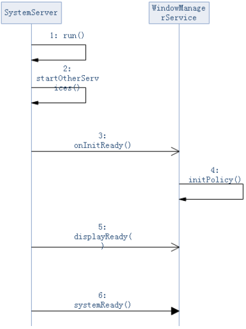

先来一张启动流程图：




和其他的系统服务一样，WMS的启动位于SystemServer.java中ServerThread类的run()函数内。

```java
// 源码路径：frameworks/base/services/java/com/android/server/SystemServer.java
private void run() {
    // ...
    try {
        traceBeginAndSlog("StartServices");
        startBootstrapServices();
        startCoreServices();
        startOtherServices();
        SystemServerInitThreadPool.shutdown();
    } catch (Throwable ex) {
        // ...
    } finally {
        // ...
    }
    // ..
}

private void startOtherServices() {
    // ...
    WindowManagerService wm = null;
    // ...
    try {
        // ...
        // 1. 创建WMS实例
        wm = WindowManagerService.main(context, inputManager, !mFirstBoot, mOnlyCore,
                 new PhoneWindowManager(), mActivityManagerService.mActivityTaskManager);
        ServiceManager.addService(Context.WINDOW_SERVICE, wm, /* allowIsolated= */ false,
                 DUMP_FLAG_PRIORITY_CRITICAL | DUMP_FLAG_PROTO);
        // ...
        // 2. 在其他实例创建完成后且与WMS建立关联后，通知WMS。
        traceBeginAndSlog("WindowManagerServiceOnInitReady"); 
        wm.onInitReady();
        traceEnd();
        // ...
    } catch (RuntimeException e) {
        // ...
    }
    // ...
    // 3. 初始化显示信息
    try {
        wm.displayReady();
    } catch (Throwable e) {
        reportWtf("making display ready", e);
    }
    // ...
    // 4. 通知WMS，系统初始化工作完成。
    try {
        wm.systemReady();
    } catch (Throwable e) {
        reportWtf("making Window Manager Service ready", e);
    }
    // ...
}
```

可以看到，WMS的创建分为三个阶段：

* WMS的实例化；

* 初始化显示信息；

* 处理systemReady通知。

  

------

接着看一下WMS的实例化：

```java
// 源码路径：frameworks/base/services/core/java/com/android/server/wm/WindowManagerService.java
public static WindowManagerService main(final Context context, final InputManagerService im, 
	final boolean showBootMsgs, final boolean onlyCore, WindowManagerPolicy policy, 
	ActivityTaskManagerService atm) {
	return main(context, im, showBootMsgs, onlyCore, policy, atm, SurfaceControl.Transaction::new);
}

public static WindowManagerService main(final Context context, final InputManagerService im, 
	final boolean showBootMsgs, final boolean onlyCore, WindowManagerPolicy policy, 
	ActivityTaskManagerService atm, TransactionFactory transactionFactory) {
	DisplayThread.getHandler().runWithScissors(() ->
		sInstance = new WindowManagerService(context, im, showBootMsgs, onlyCore, policy,
			atm, transactionFactory), 0);
	return sInstance;
}
```

------

*注意：Handler类在Android4.2中新增了一个API：runWIthScissors()。这个函数将会在Handler所在的线程中执行传入的Runnable对象，同时阻塞所在线程，直到Runnable对象的run()函数执行完毕。*

------

可以看到，main函数中，在DisplayThread中通过WMS的构造方法创建一个WMS实例。DisplayThread线程是一个前台线程，用于执行一些延时要求非常小的关于现实的操作。一般只会在WindowManager、DisplayManager和InputManager中使用。

接着来看一下WMS的构造方法，观察WMS定义了哪些重要的组件。

```java
// 源码路径：frameworks/base/services/core/java/com/android/server/wm/WindowManagerService.java
private WindowManagerService(Context context, InputManagerService inputManager,
        boolean showBootMsgs, boolean onlyCore, WindowManagerPolicy policy,
        ActivityTaskManagerService atm, TransactionFactory transactionFactory) {
    // ...
    // 1. 保存InputManagerService的实例。输入事件最终要分发给具有焦点的窗口，
    //    而WMS是窗口管理者，所以WMS是输入系统的重要一环。
    mInputManager = inputManager; // Must be before createDisplayContentLocked.
    // ...
    // 2. 存入WindowMangerPolicy实例。WMS的管理窗口的策略依据。
    mPolicy = policy;
    // 3. 创建WindowAnimator实例，管理所有窗口的动画。
    mAnimator = new WindowAnimator(this);
    // ...
    /* 4. mWindowTracing包含了mChoreographer。Choreographer的意思是编舞指导。
         它拥有从显示子系统获取Vsync同步事件的能力，从而可以在合适的时机通知渲染动作，
         避免在渲染的过程中因为发生屏幕重绘而导致的画面撕裂。
         WMS使用Choreographer负责驱动所有的窗口动画、屏幕旋转动画、墙纸动画的渲染。*/
    mWindowTracing = WindowTracing.createDefaultAndStartLooper(this, Choreographer.getInstance());
    // ...
    /* 5. 通过DisplayManager的getDisplays方法得到Display数组的元素。
    	  每个显示设备都有一个Display实例。*/
    mDisplayManager = (DisplayManager)context.getSystemService(Context.DISPLAY_SERVICE);
    // ...
}
/**
* Called after all entities (such as the {@link ActivityManagerService}) have been set up and
* associated with the {@link WindowManagerService}.
*/
public void onInitReady() {
    // 4. 初始化mPolicy。
    initPolicy();
    // Add ourself to the Watchdog monitors.
    // 5. 将自己加入到Watchdog中
    Watchdog.getInstance().addMonitor(this);
    // ...
}
```