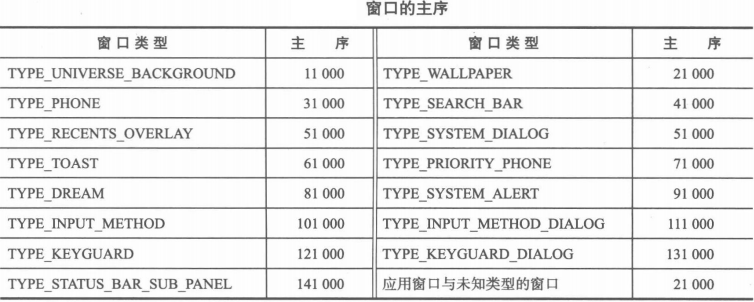
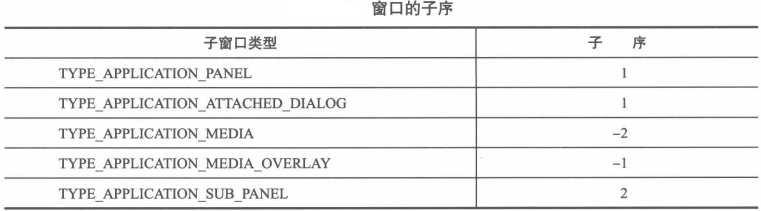

手机屏幕是以左上角为原点，向右为X轴，向下为Y轴的一个二维空间。为了方便管理窗口的显示次序，手机的屏幕被拓展为一个三位空间，即多个定义了一个Z轴，其方向垂直于屏幕表面。

## 1. 主序、子序和窗口类型

窗口的显示次序由WindowState类中的两个成员字段描述：主序mBaseLayer和子序mSubLayer。

* 主序用于描述窗口及其子窗口所在所有窗口中的显示位置。主序越大，则窗口及其子窗口的显示位置相对于其他窗口的位置越靠前。
* 子序则描述了一个子窗口相对于其兄弟窗口中的显示位置。子序越大，则子窗口相对于其兄弟窗口的位置就越靠前。

