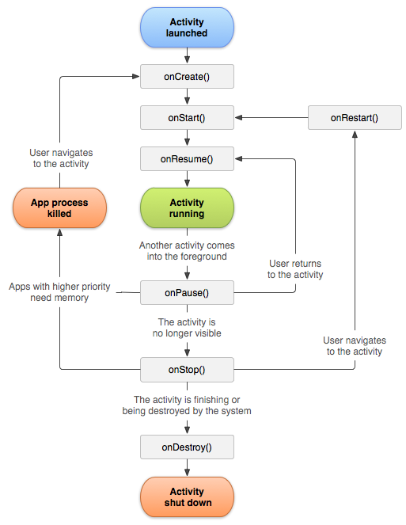

## Activity
Activity可以理解为和用户交互的界面。
#### Activity的生命周期

* onCreate
首次创建Activity时调用。可以在这里做一些初始化的工作，如setContenView去加载布局，通过findViewById获得需要的控件，以及初始化数据等。
* onStart
Activity正在被启动，此时Activity已经可见了，但没有显示在前台界面，不能和用户进行交互，比如点击事件。
* onResume
Activity已经前台可见并可以进行交互。
* onPause
Activity正在停止。
* onStop
Activity对用户不可见时调用。
* onDestroy
Activity被销毁前调用。
* onRestart
Activity已停止并即将再次启动前调用。

---
#### Actvity的启动流程
接下来分析一下Activity的启动流程，例如在launcher桌面上点击一个app的图表，launcher进程会响应onClick事件，从而调用startActivity接口启动对应的Activity:
```java
// framework/base/core/java/android/app/Activity.java
public void startActivity(Intent intent) {
    this.startActivity(intent, null);
}

public void startActivity(Intent intent, Bundle options) {
    if (options != null) {
        // ...
    } else {
        startActivityForResult(intent, -1);
    }
}

public void startActivityForResult(Intent intent, int requestCode) {
    startActivityForResult(intent, requestCode, null);
}

public void startActivityForResult(Intent intent, int requestCode, Bundle options) {
    if (mParent == null) {
        // ...
        Instrumentation.ActivityResult ar = mInstrumentation.execStartActivity(this,
            mMainThread.getApplicationThread(), mToken, this, intentm requestCode, options);
        // ...
    }
    // ...
}
```
接下来分析execStartActivity()方法：
```java
// framework/base/core/java/android/app/Instrumentation.java
public ActivityResult execStartActivity(Context who, IBinder contextThread, IBinder token,
    Activity target, Intent intent, int requestCode, Bundle options) {
    // ...
    int result = ActivityTaskManager.getService().startActivity(whoThread,
        who.getBasePackageName(), intent, intent.resolveTypeIfNeeded(who.getContentResolve()), 
        token, target != null ? target.mEmbeddedID : null, requestCode, 0, null, options);
    checkStartActivityResult(result, intent);
    // ...
}

// framework/base/core/java/android/app/ActivityTaskManager.java
// 得到一个ActivityManagerProxy代理对象
public static IActivityTaskManager getService() {
    return IActivityTaskManagerSingleton.get();
}

private static final Singleton<IActivityTaskManager> IActivityTaskManagerSingleton = new Singleton<IActivityTaskManager>() {
    protected IActivityTaskManager create() {
        final IBinder b = ServiceManager.getService(Context.ACTIVITY_TASK_SERVICE);
        return IActivityTaskManager.Stub.asInterface(b);
    }
};

// framework/base/core/java/android/util/Singleton.java
public abstract calss Singleton<T> {
    private T mInstace;
    proctected abstract T create();
    public final T get() {
        synchronized (this) {
            if (mInstance == null) {
                mInstance = create();
            }
            return mInstance;
        }
    }
}
```
通过AIDL生成的代理类IActivityManager，调用AMS的startActivity，该方法共10个参数：
* caller：当前应用的Application对象mAppThread
* callingPackage：当前Activity所在的包名
* intent：启动Activity传入的参数
* relovedType：调用intent.resolveTypeIfNeeded获取
* resultTo：当前Activity.mToken
* resultWho：当前Activity.mEmbeddedID
* requestCode：-1
* flags：0
* profilerInfo：null
* options：null
接下来分析AMS的startActivity方法：
```java
// framework/base/services/core/java/com/android/server/am/ActivityManagerService.java
public int startActivity(IApplicationThread caller, String callingPackage, 
    Intent intent, String resolvedType, IBinder resultTo, String resultWho,
    int requestCode, int startFlags, ProfilerInfo profilerInfo, Bundle bOptions) {
    return mActivityTaskManager.startActivity(caller, callingPackage, intent,
    resolvedType, resultTo, resultWho, requestCode, startFlags, profilerInfo, bOptions);
}

// framework/base/services/core/java/com/anddroid/server/wm/ActivityTaskManagerService.java
public final int startActivity(IApplicationThread caller, ...) {
    return startActivityAsUser(caller, ..., bOptions, UserHandle.getCallingUserId());
}

int startActivityAsUser(IApplicationThread caller, ..., Bundle bOptions, int userId) {
    return startActivityAsUser(caller, ..., bOptions, uersId, true);
}

int startActivityAsUser(IApplicationThread caller, ..., int userId, boolean validateIncomingUser) {
    // ...
    return getAcivityStartController().obtainStarter(intent, "startActivityAsUser")
        .setCaller(caller)
        .setCallingPackage(callingPackage)
        .setResolvedType(resolvedType)
        .setResultTo(resultTo)
        .setResultWho(resultWho)
        .setRequestCode(requestCode)
        .setStartFlags(startFlags)
        .setProfilerInfo(profilerInfo)
        .setActivityOptions(bOptions)
        .setMayWait(userId)
        .execute();
}
```
可以看到，通过建造者模式，来设置参数，通过execute方法最后执行。我们继续分析obtainStarter方法和execute方法：
```java
// framework/base/services/core/java/com/android/server/wm/AcitivityStartController.java

ActivityStarer obtainStarter(Intent intent, String reason) {
    return mFactory.obtain().setIntent(intent).setReason(reason);
}

// framework/base/core/java/com/android/server/wm/ActivityStarter.java
int execute() {
    // ...
    if (mRequest.mayWait) { // setMayWait(userId)中会设为true
        return startActivityMayWait(...);
    } else {
        // ...
    }
    // ...
}
```
接着分析startActivityMayWait方法：
```java
// framework/base/services/core/java/com/android/server/wm/ActivityStarter.java
private int startActivityMayWait(IApplicationThread caller, int callingUid, 
    String callingPackage, int requestRealCallingPid, int requestRealCallingUid,
    Intent intent, String resolveType, IVoiceInteractonSession vioceSession,
    IVoiceInteractor voiceInteractor, IBinder resultTo, String resultWho, 
    int requestCode, int startFlags, ProfileInfo profilerInfo,
    WaitResult outResult, Configuration globalConfig, SafeActivityOptions options,
    boolean ignoreTargetSecurity, int userId, TaskRecord inTask, String reason,
    boolean allowPendingRemoteAnimationRrgistryLookup, PendingIntentRecord 
    originatingPendingIntent, boolean allowBackgroudActivityStar) {
    // ...
    final ActivityRecord[] outRecord = new ActivityRecord[1];
    int res = startActivity(caller, intent, ephemeralIntent, resovledType, aInfo,
        rInfo, voiceSession, voiceInteractor, resultTo, resultWho, requestCode,
        callingPid, callingUid, callingPackage, realCallingPid, realCallingUid,
        startFlags, options, ignoreTargetSecurity, componentSpecified, outRecord,
        inTask, reason, allowPendingRemoteAnimationRegistryLookup, originatingPendingIntent,
        allowBackgroundActivityStart);
        // ...
}
```
首先了解一下前面未见过的参数：
* callingPackage：调用者所在包名。
* requestRealCallingPid
* requestRealCallingUid
* intent
* resolveType
* vioceSession
* voiceInteractor
