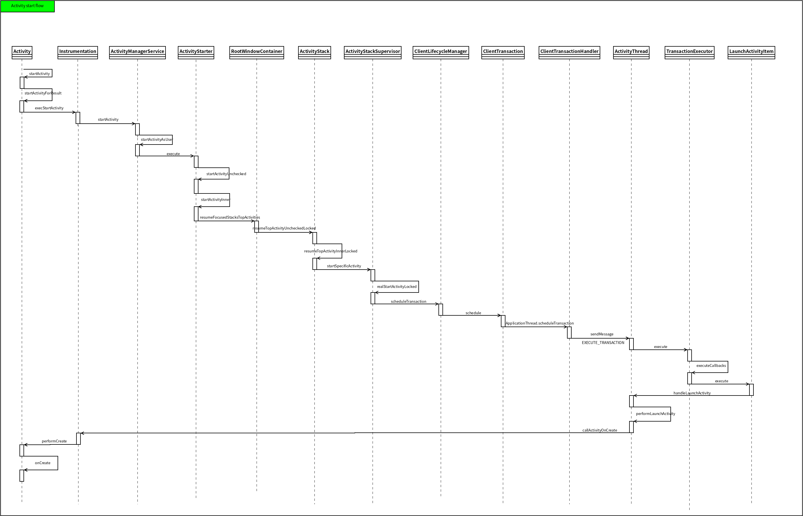
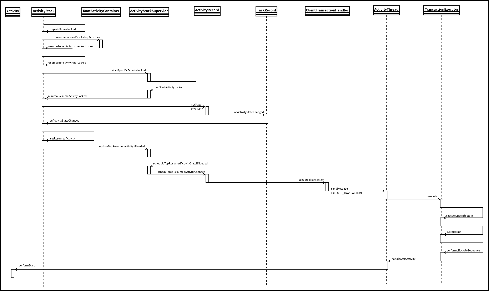

## Activity

Activity可以理解为和用户交互的界面。


## Activity的生命周期

------


* onCreate
首次创建Activity时调用。可以在这里做一些初始化的工作，如setContenView去加载布局，通过findViewById获得需要的控件，以及初始化数据等。
* onStart
Activity正在被启动，此时Activity已经可见了，但没有显示在前台界面，不能和用户进行交互，比如点击事件。
* onResume
Activity已经前台可见并可以进行交互。
* onPause
Activity正在停止。
* onStop
Activity对用户不可见时调用。
* onDestroy
Activity被销毁前调用。
* onRestart
Activity已停止并即将再次启动前调用。


## Activity切换流程

------

Activity1切换到Actvity2的流程如下：

Activity1 onPause	-->	Activity2 onCreate	-->	Activity2 onStart	-->	Activity2 onResume	-->	Activity1 onStop	--> Activity1 onDestroy


## Actvity的启动流程

------

### onCreate



接下来分析一下Activity的启动流程，例如在launcher桌面上点击一个app的图表，launcher进程会响应onClick事件，从而调用startActivity接口启动对应的Activity:

```java
// framework/base/core/java/android/app/Activity.java
public void startActivity(Intent intent) {
    this.startActivity(intent, null);
}

public void startActivity(Intent intent, Bundle options) {
    if (options != null) {
        // ...
    } else {
        startActivityForResult(intent, -1);
    }
}

public void startActivityForResult(Intent intent, int requestCode) {
    startActivityForResult(intent, requestCode, null);
}

public void startActivityForResult(Intent intent, int requestCode, Bundle options) {
    if (mParent == null) {
        // ...
        Instrumentation.ActivityResult ar = mInstrumentation.execStartActivity(this,
            mMainThread.getApplicationThread(), mToken, this, intentm requestCode, options);
        // ...
    }
    // ...
}
```
接下来分析execStartActivity()方法：

```java
// framework/base/core/java/android/app/Instrumentation.java
public ActivityResult execStartActivity(Context who, IBinder contextThread, IBinder token,
    Activity target, Intent intent, int requestCode, Bundle options) {
    // ...
    int result = ActivityTaskManager.getService().startActivity(whoThread,
        who.getBasePackageName(), intent, intent.resolveTypeIfNeeded(who.getContentResolve()), 
        token, target != null ? target.mEmbeddedID : null, requestCode, 0, null, options);
    checkStartActivityResult(result, intent);
    // ...
}

// framework/base/core/java/android/app/ActivityTaskManager.java
// 得到一个ActivityManagerProxy代理对象
public static IActivityTaskManager getService() {
    return IActivityTaskManagerSingleton.get();
}

private static final Singleton<IActivityTaskManager> IActivityTaskManagerSingleton = new Singleton<IActivityTaskManager>() {
    protected IActivityTaskManager create() {
        final IBinder b = ServiceManager.getService(Context.ACTIVITY_TASK_SERVICE);
        return IActivityTaskManager.Stub.asInterface(b);
    }
};

// framework/base/core/java/android/util/Singleton.java
public abstract calss Singleton<T> {
    private T mInstace;
    proctected abstract T create();
    public final T get() {
        synchronized (this) {
            if (mInstance == null) {
                mInstance = create();
            }
            return mInstance;
        }
    }
}
```
通过AIDL生成的代理类IActivityManager，调用AMS的startActivity，该方法共10个参数：

* caller：当前应用的Application对象mAppThread

* callingPackage：当前Activity所在的包名

* intent：启动Activity传入的参数

* relovedType：调用intent.resolveTypeIfNeeded获取

* resultTo：当前Activity.mToken

* resultWho：当前Activity.mEmbeddedID

* requestCode：-1

* flags：0

* profilerInfo：null

* options：null

  

接下来分析AMS的startActivity方法：

```java
// framework/base/services/core/java/com/android/server/am/ActivityManagerService.java
public int startActivity(IApplicationThread caller, String callingPackage, 
    Intent intent, String resolvedType, IBinder resultTo, String resultWho,
    int requestCode, int startFlags, ProfilerInfo profilerInfo, Bundle bOptions) {
    return mActivityTaskManager.startActivity(caller, callingPackage, intent,
    resolvedType, resultTo, resultWho, requestCode, startFlags, profilerInfo, bOptions);
}

// framework/base/services/core/java/com/anddroid/server/wm/ActivityTaskManagerService.java
public final int startActivity(IApplicationThread caller, ...) {
    return startActivityAsUser(caller, ..., bOptions, UserHandle.getCallingUserId());
}

int startActivityAsUser(IApplicationThread caller, ..., Bundle bOptions, int userId) {
    return startActivityAsUser(caller, ..., bOptions, uersId, true);
}

int startActivityAsUser(IApplicationThread caller, ..., int userId, boolean validateIncomingUser) {
    // ...
    return getAcivityStartController().obtainStarter(intent, "startActivityAsUser")
        .setCaller(caller)
        .setCallingPackage(callingPackage)
        .setResolvedType(resolvedType)
        .setResultTo(resultTo)
        .setResultWho(resultWho)
        .setRequestCode(requestCode)
        .setStartFlags(startFlags)
        .setProfilerInfo(profilerInfo)
        .setActivityOptions(bOptions)
        .setMayWait(userId)
        .execute();
}
```
可以看到，通过建造者模式，来设置参数，通过execute方法最后执行。我们继续分析obtainStarter方法和execute方法：

```java
// framework/base/services/core/java/com/android/server/wm/AcitivityStartController.java

ActivityStarer obtainStarter(Intent intent, String reason) {
    return mFactory.obtain().setIntent(intent).setReason(reason);
}

// framework/base/core/java/com/android/server/wm/ActivityStarter.java
int execute() {
    // ...
    mLastStartActivityResult = startActivityUnchecked(r, sourceRecord, voiceSession,
           request.voiceInteractor, startFlags, true /* doResume */, checkedOptions, inTask,
           restrictedBgActivity, intentGrants);
    // ...
}
private int startActivityUnchecked(final ActivityRecord r, ActivityRecord sourceRecord,
       IVoiceInteractionSession voiceSession, IVoiceInteractor voiceInteractor,
        int startFlags, boolean doResume, ActivityOptions options, Task inTask,
       boolean restrictedBgActivity, NeededUriGrants intentGrants) {
    int result = START_CANCELED;
    // ...
    Trace.traceBegin(Trace.TRACE_TAG_WINDOW_MANAGER, "startActivityInner");
    result = startActivityInner(r, sourceRecord, voiceSession, voiceInteractor,
                                startFlags, doResume, options, inTask, 
                                restrictedBgActivity, intentGrants); 
    // ...
    return result;
}
int startActivityInner(final ActivityRecord r, ActivityRecord sourceRecord,
        IVoiceInteractionSession voiceSession, IVoiceInteractor voiceInteractor,
        int startFlags, boolean doResume, ActivityOptions options, Task inTask,
        boolean restrictedBgActivity, NeededUriGrants intentGrants) {
    // ...
    mRootWindowContainer.resumeFocusedStacksTopActivities(
        mTargetStack, mStartActivity, mOptions);
    // ...
}
```
接着看resumeFocusedStacksTopActivities方法的实现

```java
// RootWindowContainer.java
boolean resumeFocusedStacksTopActivities(
    ActivityStack targetStack, ActivityRecord target, ActivityOptions targetOptions) {
    // ..
    if (targetStack != null && (targetStack.isTopStackInDisplayArea()
                                || getTopDisplayFocusedStack() == targetStack)) {
        result = targetStack.resumeTopActivityUncheckedLocked(target, targetOptions);
    }
}
```

继续

```java
// ActivityStack.java
boolean resumeTopActivityUncheckedLocked(ActivityRecord prev, ActivityOptions options) {
    // ...
    result = resumeTopActivityInnerLocked(prev, options);
    // ...
}

private boolean resumeTopActivityInnerLocked(ActivityRecord prev, ActivityOptions options) {
    // ...
    mStackSupervisor.startSpecificActivity(next, true, true);
    // ...
}
```

继续

```java
// ActivityStackSupervisor.java
void startSpecificActivity(ActivityRecord r, boolean andResume, boolean checkConfig) {
    // ...
    realStartActivityLocked(r, wpc, andResume, checkConfig);
    // ...
}

boolean realStartActivityLocked(ActivityRecord r, WindowProcessController proc,
            boolean andResume, boolean checkConfig) throws RemoteException {
    // ...
    // 核心部分
    clientTransaction.addCallback(LaunchActivityItem.obtain(new Intent(r.intent),
           System.identityHashCode(r), r.info,
           // TODO: Have this take the merged configuration instead of separate global
           // and override configs.
     		mergedConfiguration.getGlobalConfiguration(),
            mergedConfiguration.getOverrideConfiguration(), r.compat,
            r.launchedFromPackage, task.voiceInteractor, proc.getReportedProcState(),
            r.getSavedState(), r.getPersistentSavedState(), results, newIntents,
            dc.isNextTransitionForward(), proc.createProfilerInfoIfNeeded(),
            r.assistToken, r.createFixedRotationAdjustmentsIfNeeded()));

    // Set desired final state.
    final ActivityLifecycleItem lifecycleItem;
    if (andResume) {
        lifecycleItem = ResumeActivityItem.obtain(dc.isNextTransitionForward());
    } else {
        lifecycleItem = PauseActivityItem.obtain();
    }
    clientTransaction.setLifecycleStateRequest(lifecycleItem);

    // Schedule transaction.
    mService.getLifecycleManager().scheduleTransaction(clientTransaction);
}
```

可以看到，如上创建了ClientTransaction对象，然后通过clientTransaction.addCallback添加了一个LauncherActivityItem对象，（LauncherActivityItem.obtain方法返回的是一个LauncherActivityItem对象），此处为realStartActivityLocked方法的核心部分。

然后调用ClientLifecycleManager的scheduleTransaction方法将当前的事务进行提交，接着看一下该方法的实现：

```java
// ClientLifecycleManager.java
void scheduleTransaction(ClientTransaction transaction) throws RemoteException {
    final IApplicationThread client = transaction.getClient();
    // 此处为事务的提交。
    transaction.schedule();
    if (!(client instanceof Binder)) {
        // If client is not an instance of Binder - it's a remote call and at this point it is
        // safe to recycle the object. All objects used for local calls will be recycled after
        // the transaction is executed on client in ActivityThread.
        transaction.recycle();
    }
}
// ClientTransaction类中的的schedule方法
public void schedule() throws RemoteException {
    mClient.scheduleTransaction(this); //mClient为IApplicationThread
}

// IApplicationThread的实现类为ActivityThread的内部类ApplicationThread
public void scheduleTransaction(ClientTransaction transaction) throws RemoteException {
    ActivityThread.this.scheduleTransaction(transaction);
}
```

可以看到最终call到了ActivityThread父类ClientTransactionHandler的scheduleTransaction方法，接下来继续看其具体实现：

```java
// ClientTransactionHandler.java
void scheduleTransaction(ClientTransaction transaction) {
    transaction.preExecute(this);
    sendMessage(ActivityThread.H.EXECUTE_TRANSACTION, transaction);
}
```

接着分析ActivityThread收到H.EXECUTE_TRANSACTION消息的处理：

```java
// ActivityThread.java
public void handleMessage(Message msg) {
    // ...
    case EXECUTE_TRANSACTION:
    final ClientTransaction transaction = (ClientTransaction) msg.obj;
    // 此处执行事务
    mTransactionExecutor.execute(transaction);
    if (isSystem()) {
        // Client transactions inside system process are recycled on the client side
        // instead of ClientLifecycleManager to avoid being cleared before this
        // message is handled.
        transaction.recycle();
    }
    // TODO(lifecycler): Recycle locally scheduled transactions.
    break;
    // ...
}
```

可以看到，mTransactionExecutor.execute()正式进入了事务的执行过程，看其实现：

```java
// TransactionExecutor.java
public void execute(ClientTransaction transaction) {
    // ...
    executeCallbacks(transaction);
    // ...
}

public void executeCallbacks(ClientTransaction transaction) {
    final List<ClientTransactionItem> callbacks = transaction.getCallbacks();
    // ...
    final int size = callbacks.size();
    for (int i = 0; i < size; ++i) {
        final ClientTransactionItem item = callbacks.get(i);
        // ...
        item.execute(mTransactionHandler, token, mPendingActions);
        tem.postExecute(mTransactionHandler, token, mPendingActions);
        // ...
    }
}
```

可以看到，callbacks.get()方法获取的是ClientTransactionItem对象，根据realStartActivityLocked()方法中，clientTransaction.addCallback()可知，ClientTransactionItem的具体实现类是LaunchActivityItem类，因此，接着看item.execute()方法的实现：

```java
// LaunchActivityItem.java
public void execute(ClientTransactionHandler client, IBinder token,
         PendingTransactionActions pendingActions) {
    Trace.traceBegin(TRACE_TAG_ACTIVITY_MANAGER, "activityStart");
    ActivityClientRecord r = new ActivityClientRecord(token, mIntent, mIdent, mInfo,
            mOverrideConfig, mCompatInfo, mReferrer, mVoiceInteractor, mState, mPersistentState,
            mPendingResults, mPendingNewIntents, mIsForward,
            mProfilerInfo, client, mAssistToken, mFixedRotationAdjustments);
    client.handleLaunchActivity(r, pendingActions, null /* customIntent */);
    Trace.traceEnd(TRACE_TAG_ACTIVITY_MANAGER);
}
```

根据前面`ActivityThread.this.scheduleTransaction(transaction);`可知，client.handleLaunchActivity方法最终执行的是ActivityThread中的handleLuanchActivity方法，接下来看其实现：

```java
// ActivityThread.java
public Activity handleLaunchActivity(ActivityClientRecord r,
        PendingTransactionActions pendingActions, Intent customIntent) {
    // ...
    final Activity a = performLaunchActivity(r, customIntent);
    // ...
}

private Activity performLaunchActivity(ActivityClientRecord r, Intent customIntent) {
    ActivityInfo aInfo = r.activityInfo;
    // ...
    if (r.isPersistable()) {
        mInstrumentation.callActivityOnCreate(activity, r.state, r.persistentState);
    } else {
        mInstrumentation.callActivityOnCreate(activity, r.state);
    }
    // ...
}
```

接着进入Instrumentation类看其callActivityOnCreate方法：

```java
// Instrumentation.java
public void callActivityOnCreate(Activity activity, Bundle icicle) {
    prePerformCreate(activity);
    activity.performCreate(icicle);
    postPerformCreate(activity);
}
```

接着进入Activity类，看其performCreate方法的实现：

```java
// Activity.java
final void performCreate(Bundle icicle) {
    performCreate(icicle, null);
}

final void performCreate(Bundle icicle, PersistableBundle persistentState) {
    // ...
    if (persistentState != null) {
        onCreate(icicle, persistentState);
    } else {
        onCreate(icicle);
    }
    // ...
}
```

至此，回调到自定义Activity的onCreate()方法中。


### onStart

onStart阶段是在前一个activity执行完onPause后才被触发，我们以前一个activityOnPaused阶段为起始点分析其调用流程（基于Android10）。




### onResume


### onPause

在activity1下start activity2，在activity2的创建过程中，会先执行pause actvity1，以start activity2的过程为起点分析activity1的onPause流程。


### onStop


### onDestroy


