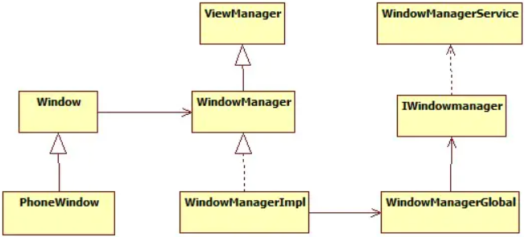

# window，WindowManager和WindowManagerService之间关系

在Android中，Window是所有视图的载体，如Activty，Dialog以及Toast的视图。我们相对Window进行添加和删除就要通过WindowManager来操作。而WindowManager通过Binder和WindowManagerService进行挂进程通信，将具体的工作交给WindowManagerService。


## 1. Winow

Window在Android开发中是一个窗口的概念，他是一个抽象类：

```java
// 源码路径：frameworks/base/core/java/android/view/Window.java
public abstract class Window {
    public static final int FEATURE_OPTIONS_PANEL = 0;
    public static final int FEATURE_NO_TITLE = 1;
	// ...
    public abstract @NonNull View getDecorView(); 
    public abstract void setContentView(@LayoutRes int layoutResID);
    public abstract void setContentView(View view);
    public abstract void setContentView(View view, ViewGroup.LayoutParams params);
    public <T extends View> T findViewById(@IdRes int id) {
        return getDecorView().findViewById(id);
    }
    // ...
}
```

可以看到，里面有我们熟悉的一些字段和方法。以Activity对应的Window为例，具体的实现类是PhoneWindow，在PhoneWindow中有一个顶级View：DecorView，继承自FrameLayout，可以通过getDecorView()方法获得它。当在Activity的onCreate()方法中调用setContentView时，实际最终会调用Window的setContentView，当调用Activity的findViewById时，真正上调用的时Window的findViewById，这也间接说明了Window是View的直接管理者。但是Window并不是真实存在的，它更多的表示一种抽象的功能集合，View才是Android中的视图呈现形式，绘制到屏幕上的是View不是Window，但是View不能单独存在，它必须依附在Window这个抽象的概念上面，ANdroid中需要依赖Window提供的视图有Activity，Dialog，Toast，输入法窗口等。


### 1.1 Window类型与层级

Window的类型type被定义在WindowManager中的静态内部类LayoutParams中：

```java
// 源码路径：frameworks/base/core/java/android/view/WindowManager.java 
public static class LayoutParams extends ViewGroup.LayoutParams implements Parcelable {
    /* 应用窗口type值 */
    public static final int FIRST_APPLICATION_WINDOW = 1; // 应用程序窗口的起始值。
    // 窗口的基础值，其他窗口的type值要大于这个值
    public static final int TYPE_BASE_APPLICATION   = 1;
    // 普通应用程序窗口，token必须设置为Activity的token来指定窗口属于谁
    public static final int TYPE_APPLICATION        = 2;
    public static final int TYPE_APPLICATION_STARTING = 3;
    public static final int TYPE_DRAWN_APPLICATION = 4;
    // 应用窗口的结束值
    public static final int LAST_APPLICATION_WINDOW = 99;
    
    /* 子窗口type值 */
    public static final int FIRST_SUB_WINDOW = 1000;  // 子窗口起始值
    public static final int TYPE_APPLICATION_PANEL = FIRST_SUB_WINDOW;
    public static final int TYPE_APPLICATION_MEDIA = FIRST_SUB_WINDOW + 1;
    public static final int TYPE_APPLICATION_SUB_PANEL = FIRST_SUB_WINDOW + 2;
    public static final int TYPE_APPLICATION_ATTACHED_DIALOG = FIRST_SUB_WINDOW + 3;
    public static final int TYPE_APPLICATION_MEDIA_OVERLAY  = FIRST_SUB_WINDOW + 4;
    public static final int TYPE_APPLICATION_ABOVE_SUB_PANEL = FIRST_SUB_WINDOW + 5;
    public static final int LAST_SUB_WINDOW = 1999; // 子窗口结束值
    
    /* 系统窗口type值 */
    public static final int FIRST_SYSTEM_WINDOW     = 2000;
    public static final int TYPE_SEARCH_BAR         = FIRST_SYSTEM_WINDOW+1;
    public static final int TYPE_PHONE              = FIRST_SYSTEM_WINDOW+2;
    public static final int TYPE_SYSTEM_ALERT       = FIRST_SYSTEM_WINDOW+3;
    // ...
    public static final int LAST_SYSTEM_WINDOW      = 2999;
}
```

LayoutParams中以TYPE开头的值有很多，但总体可以分为3类：

* 应用程序窗口：type值1-99，Activity就是一个典型的应用程序窗口，type值是TYPE_BASE_APPLICATION，WindowManager的LayoutParams默认type值是TYPE_APPLICATION。
* 子窗口：type值范围1000-1999，PupupWindow就是一个典型的子窗口，type值是TYPE_APPLICATION_PANEL，子窗口不能独立存在，必须依附于父窗口。
* 系统窗口：type值范围2000-2999，系统状态栏就是一个典型的系统窗口，type值是TYPE_STATUS_BAR，与应用窗口不同的是，系统窗口的创建需要声明权限。

type值决定了Window显示的层级（z-order），一般情况下，type值越大，则窗口显示的越靠前。


### 1.2 Window的属性

Window的类型flag同样被定义在WindowManager的静态内部类LayoutParams中：

```java
// 源码路径：frameworks/base/core/java/android/view/WindowManager.java
public static class LayoutParams extends ViewGroup.LayoutParams implements Parcelable {
    public static final int FLAG_ALLOW_LOCK_WHILE_SCREEN_ON     = 0x00000001;
    public static final int FLAG_DIM_BEHIND        = 0x00000002;
    public static final int FLAG_BLUR_BEHIND        = 0x00000004;
    public static final int FLAG_NOT_FOCUSABLE      = 0x00000008;
    public static final int FLAG_NOT_TOUCHABLE      = 0x00000010;
     public static final int FLAG_NOT_TOUCH_MODAL    = 0x00000020;
    // ...
}
```

LayoutParams中定义的flag属性同样很多，挑几个看一下：

* FLAG_ALLOW_LOCK_WHILE_SCREEN_ON 只要窗口对用户可见，就允许在屏幕开启的状态下锁屏。
* FLAG_KEEP_SCREEN_ON 只要窗口对用户可见，屏幕就一直亮着。
* FLAG_SHOW_WHEN_LOCKED 窗口可以在锁屏的界面上显示。
* LAG_NOT_FOCUSABLE 窗口不能获取焦点，也不能接受任何输入事件，此标志同时会启用FLAG_NOT_TOUCH_MODAL，最终事件会直接传递给下层的具有焦点的窗口。
* FLAG_NOT_TOUCH_MODAL 当前窗口区域以外的触摸事件会传递给底层的窗口，当前窗口区域内的触摸事件则自己处理，一般来说都要开启此标记，否则其他Window将无法收到单机事件。
* FLAG_NOT_TOUCHABLE 窗口不接收任何触摸事件。


## 2. WindowManager

WindowManager是一个接口，有三个常用方法：addView()，updateViewLayout()，removeView()。其中WindowManager继承自ViewManager，这三个方法也是定义在ViewManager中：

```java
// 源码路径：frameworks/base/core/java/android/view/WindowManager.java
public interface ViewManager {
    public void addView(View view, ViewGroup.LayoutParams params);
    public void updateViewLayout(View view, ViewGroup.LayoutParams params);
    public void removeView(View view); 
}
```

可以看到这些方法传入的参数是View，不是Window，说明WindowManager管理的是Window中的View。WindowManager的具体实现类是WindowManagerImpl：

```java
// 源码路径：frameworks/base/core/java/android/view/WindowManagerImpl.java
public final class WindowManagerImpl implements WindowManager {
    private final WindowManagerGlobal mGlobal = WindowManagerGlobal.getInstance();
    private final Context mContext;
    private final Window mParentWindow;
    // ...
    public void addView(@NonNull View view, @NonNull ViewGroup.LayoutParams params) {
        applyDefaultToken(params);
        mGlobal.addView(view, params, mContext.getDisplay(), mParentWindow);
    }
    
    public void updateViewLayout(@NonNull View view, @NonNull ViewGroup.LayoutParams params) {
        applyDefaultToken(params);
        mGlobal.updateViewLayout(view, params);
    }
    
    public void removeView(View view) {
        mGlobal.removeView(view, false);
    }
}
```

可以看到WindowManagerImpl将3个方法都委托给了WindowManagerGlobal这个单例类，我们还看到了mParentWindow这个字段，它是Window类型，是从构造中被传入，所以WindowManager会持有Window的引用，这样WindowManager就可以对Window进行操作了。

接下来看一下mGlobal是如何向Window中添加View的：

```java
// 源码路径：frameworks/base/core/java/com/android/view/WindowManagerGlobal.java
public final class WindowManagerGlobal {
    public void addView(View view, ViewGroup.LayoutParams params,
                        Display display, Window parentWindow) {
        // ...
        ViewRootImpl root;
        // ...
        root = new ViewRootImpl(view.getContext(), display);
        // ...
        root.setView(view, wparams, panelParentView);
        // ...
    }
}

// 源码路径：frameworks/base/core/java/com/android/view/ViewRootImpl.java
public final class ViewRootImpl implements ViewParent, View.AttachInfo.Callbacks, ThreadedRenderer.DrawCallbacks {
    public void setView(View view, WindowManager.LayoutParams attrs, View panelParentView) {
        // ...
        requestLayout(); 
        // ...
        res = mWindowSession.addToDisplay(mWindow, mSeq, mWindowAttributes,
               getHostVisibility(), mDisplay.getDisplayId(), mTmpFrame,
               mAttachInfo.mContentInsets, mAttachInfo.mStableInsets,
               mAttachInfo.mOutsets, mAttachInfo.mDisplayCutout, mInputChannel,
               mTempInsets);
        // ...
    }
}
```

可以看，在ViewRootlmp的setView中，首先通过requestLayout()发起View绘制流程，然后在mWindowSession的addToDisplay中通过Binder与WMS进行跨进程通信，请求显示窗口上的视图，至此，view就会显示到屏幕上。这个mWindowSession是一个IWindowSession.AIDL接口类型，用来实现挂进程通信，在WMS内部会为每一个应用的请求保留一个单独的Session，同样实现了IWindowSession接口，应用与WMS之间的通信就通过这个Session。那么mWindowSession是什么时候被赋值的呢？

```java
// 源码路径：frameworks/base/core/java/com/android/view/ViewRootImpl.java
public final class ViewRootImpl implements ViewParent, View.AttachInfo.Callbacks, ThreadedRenderer.DrawCallbacks {
    // ...
    public ViewRootImpl(Context context, Display display) { 
        // ...
        mWindowSession = WindowManagerGlobal.getWindowSession();
        // ...
    }
}

// 源码路径：frameworks/base/core/java/com/android/view/WindowManagerGlobal.java
public final class WindowManagerGlobal {
	public static IWindowSession getWindowSession() {
        synchronized (WindowManagerGlobal.class) {
            if (sWindowSession == null) {
                try {
                    // Emulate the legacy behavior.  The global instance of InputMethodManager
                    // was instantiated here.
                    // TODO(b/116157766): Remove this hack after cleaning up @UnsupportedAppUsage
                    InputMethodManager.ensureDefaultInstanceForDefaultDisplayIfNecessary();
                    // 1. 首先获取WMS的本地代理
                    IWindowManager windowManager = getWindowManagerService();
                    // 2. 通过WMS的本地代理的openSession来获取Session
                    sWindowSession = windowManager.openSession(
                        new IWindowSessionCallback.Stub() {
                            @Override
                            public void onAnimatorScaleChanged(float scale) {
                                ValueAnimator.setDurationScale(scale);
                            }
                        });
                } catch (RemoteException e) {
                    throw e.rethrowFromSystemServer();
                }
            }
            return sWindowSession;
        }
    }
}
```


## 3. 关系图

Window是View的载体，我们想要对Window进行删除，添加，更新View就得通过WindowManager，WindowManager与WMS通过Session进行通信，具体的实现就交给了WMS处理，WMS会为每一个Window创建一个WindowState并管理它们，具体的渲染工作WMS就交给SurfaceFinger处理。




