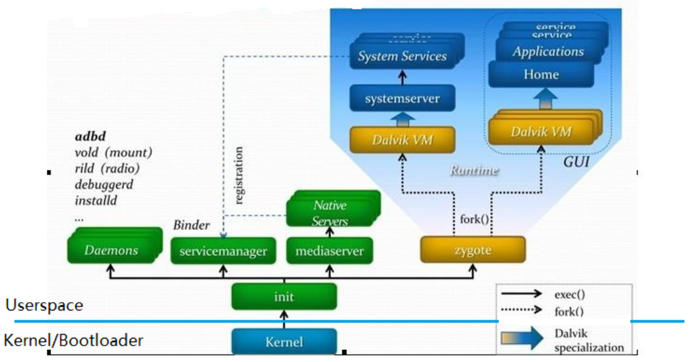

# Android Boot-time Optimize

## 1. Tools
### (1) bootchart
* 使用：
```
touch /data/bootchart/enabled
tar -czf bootchart.tgz header proc_diskstats.log proc_ps.log proc_stat.log
java -jar bootchart.jar bootchar.tgz
```
* 说明：
1） 观察zogote、system_server、launcher的启动时间点
2） 观察整个开机过程中的cpu/io使用情况
### (2) ftrace
* 使用：
```
1. build.prop
debug.atrace.tags.enableflags=802922
2. bootargs: 
trace_buf_size=64M trace_event=sched_wakeup,sched_switch,sched_blocked_reason,sched_cpu_hotplug
3. analyze:
cat /d/tracing/trace > /data/trace_out
git clone https://github.com/catapult-project/catapult.git --depth=10
./trace2html  trace
```
* 说明：
可以得到system-server、launcher更详细的启动信息。
## 2. Android boot flow
Android启动流程如下：
bootloader ---> kernel ---> init ---> zygote ---> system_server ---> launcher
见下图：

## 3. Optimization
分析开机每个阶段的耗时，来进行优化。
* bootloader的优化:
* kernel的优化：
1）减小kernel的大小。包括，优化未使用的驱动，减小驱动程序的大小；取消未使用的配置功能、文件系统等。
2）修改kernel的解压方法，提高解压速度。
* init的优化：
主要是将zygote的启动时间往前提。
1）删除init.*.rc中所有未使用的服务和命令
2）尽早启动关键服务。可以查看logcat日志，找到ServiceManager中“wait for service”，将相关的服务提前。
3）识别 init 中的缓慢操作。根据kernel日志，分析init中的耗时操作。
* zygote优化：
主要针对preloadClasses进行优化。（ftrace可以抓取改阶段时间）
* system_server的优化：
1）优化不需要启动的服务。
2）调整服务的启动顺序。
* launcher的优化
1）观察launcher启动阶段的瓶颈。将同阶段启动的服务和应用延后启动。
2）给launcher添加directBoot属性，提前启动。
* IO优化
linux有readahead功能，调整预读块大小，防止产生IO瓶颈。
* 优化SELINUX

