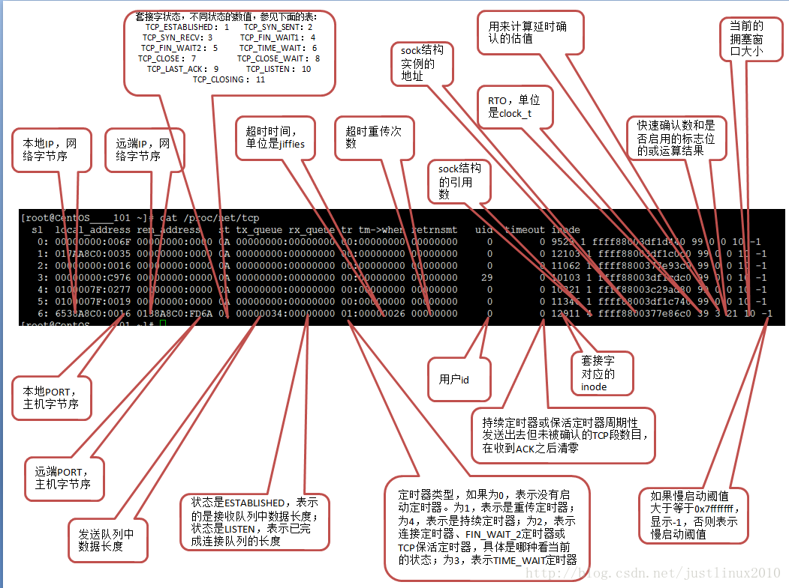

# Linux重要目录说明

[TOC]


# proc

## acpi

ACPI（高级配置和电源接口）支持操作系统设置和控制各个硬件部件。


## asound
ALSA使用/proc/asound目录下的文件保存设备信息并且实现一些控制目的。

* cardX
  对于系统中已经识别的每个声卡都存在对应的cardX目录。

*  cards
  已注册的声卡的列表。

*  devices
  已注册的ALSA设备的列表.

* modules
  已注册声卡驱动的列表，并不是所有为ALSA所加载的内核模块，而是硬件驱动的列表。一行对应一个正在使用的声卡.

* oss
  OSS（Open Sound System）是unix平台上一个统一的音频接口.

*  pcm
  已分配的pcm流的列表。

*  seq
   包含关于音序器的信息

* timers
  ALSA已知的计时器的列表.

*  version

  ALSA子系统模块（或内核）构建的版本和日期。

  

## cgroups

系统支持的cgroup子系统

```
#subsys_name	hierarchy	num_cgroups	enabled
cpuset	5	1	1
cpu	3	1	1
cpuacct	3	1	1
blkio	7	1	1
memory	2	54	1
devices	9	27	1
freezer	11	1	1
net_cls	10	1	1
perf_event	6	1	1
net_prio	10	1	1
hugetlb	4	1	1
pids	8	30	1
rdma	12	1	1
```


## cmdline

内核启动参数，只读。

```
BOOT_IMAGE=/boot/vmlinuz-linux root=UUID=e9dec0fd-9765-46db-89f0-36756117d68c rw loglevel=3 quiet
```


## cpuinfo

提供了cpu的详细信息。


## crypto

 内核支持的加密方式。


## devices

列出字符和块设备的主设备号，以及分配到这些设备号的设备名称。


## diskstats

统计磁盘信息。

```
设备号 编号 设备  读完成次数  合并完成次数   读扇区次数   读操作花费毫秒数   写完成次数   合并写完成次数   写扇区次数   写操作花费的毫秒数   正在处理的输入/输出请求数   输入/输出操作花费的毫秒数   输入/输出操作花费的加权毫秒数。
  11       0 sr0 9 0 3 8 0 0 0 0 0 27 8 0 0 0 0 0 0
   8       0 sda 25073 9474 1411988 10072 77806 52837 1274166 72426 0 64194 82499 0 0 0 0 0 0
   8       1 sda1 161 2027 15998 43 3 0 10 2 0 97 45 0 0 0 0 0 0
   8       2 sda2 58 0 4424 15 0 0 0 0 0 34 15 0 0 0 0 0 0
   8       3 sda3 24796 7447 1389270 9998 77803 52837 1274156 72424 0 64157 82423 0 0 0 0 0 0
```


## dynamic_debug

kernel相关的动态调试功能。


## execdomains

内核当前支持的执行域。


## filesystems

系统支持的文件系统。


## fs

* cifs

  CIFS是实现文件共享服务的一种文件系统。

* ext4

  第四代扩展文件系统（Fourth extended filesystem）是linux系统下的日志文件系统，是ext3文件系统的后继版本。

* jbd2

  jbd的全拼是journaling block driver 文件系统的日志功能，jbd2是ext4文件系统版本。

* nfsd

  nfs的守护进程，负责接收到用户的调用请求后与内核发出请求并得到调用结果响应给用户。

## interrupts

interrupts中的字段依次是逻辑中断号、中断在各CPU上发生的次数，中断所属父设备名称、硬件中断号、中断触发方式(电平或边沿)、中断名称。

```
           CPU0       CPU1       CPU2       CPU3       
 26:    7520290    6505367    6092411    8058138     GICv2  26 Level     arch_timer
 32:       8184          0          0          0     GICv2  32 Level     ttyS0
 33:          1          0          0          0     GICv2  33 Level     1f002800.keypad, RTC_PM, (null)
 37:      57255          0          0          0     GICv2  37 Level     mstar_mci
 38:          1          0          0          0     GICv2  38 Level     Mstar-otg
 39:       3672          0          0          0     GICv2  39 Level     ehci_hcd:usb1
```


## iomem

记录了物理地址的分配情况。


## ioports

IO port空间的地址资源分配情况。


## irq

为每个注册的irq创建一个以irq编号为名字的子目录。每个子目录下的内容：

```
-r--r--r--  affinity_hint 只读条目，用于用户空间做irq平衡只用。
-r--r--r--  effective_affinity
-r--r--r--  effective_affinity_list
-rw-rw-rw-  irq
-r--r--r--  node
-rw-r--r--  smp_affinity    irq和cpu之间的亲缘绑定关系。
-rw-r--r--  smp_affinity_list
-r--r--r--  spurious    可以获得该irq被处理和未被处理的次数的统计信息。
```


## kallsyms

kallsyms抽取了内核用到的所有函数地址(全局的、静态的)和非栈数据变量地址，生成一个数据块，作为只读数据链接进kernel image，相当于内核中存了一个System.map。


## kmsg

打印内核的信息， 但是与dmesg 有不同， 第一次执行/proc/kmsg 打印到目前位置的所有内核信息，再次执行/proc/kmsg，不打印打印过了的信息。


## loadavg

系统平均负载:在特定时间间隔内运行队列中的平均进程数。

```
53.03 52.68 52.59 4/1521 10165
前三个是1、5、15分钟内的平均进程数。第四个的分子是正在运行的进程数，分母是进程总数；最后一个最近运行的进程ID号。
```


## meminfo

系统内存的使用情况。


## modules

系统模块（lsmod)

```
第一列： 模块的名字
第二列： 模块的内存大小，单位是bytes
第三列： 被load的次数，0以为着没有被load过
第四列： 是否依赖第三方moudle，列出这些module
第五列： 模块的状态，有Live， Loading， Unloading三种状态
第六列： 模块当前的内核内存偏移位置。这些信息，debug的时候会非常有用。例如一些诊断工具 oprofile。
```


## mounts

已挂载的设备。


## net

网络相关。

### anycast6

IPv6任播（anycast）地址。在网卡上新配置一个IPv6地址，就会在 /proc/net/anycast6下生成一个对应的任播地址。

### arp

arp缓存表。
```
IP address       HW type     Flags       HW address            Mask     Device
192.168.190.2    0x1         0x2         00:50:56:e2:4b:17     *        ens33
192.168.190.254  0x1         0x2         00:50:56:e8:78:8e     *        ens33
```

### dev
```
 face |bytes    packets errs drop fifo frame compressed multicast|bytes    packets errs drop fifo colls carrier compressed
    lo: 10704135     823    0    0    0     0          0         0 10704135     823    0    0    0     0       0          0
 ens33: 6231658   29913    0    0    0     0          0         0  1447453   15415    0    0    0     0       0          0
 
bytes: The total number of bytes of data transmitted or received by the interface.（接口发送或接收的数据的总字节数）
packets: The total number of packets of data transmitted or received by the interface.（接口发送或接收的数据包总数）
errs: The total number of transmit or receive errors detected by the device driver.（由设备驱动程序检测到的发送或接收错误的总数）
drop: The total number of packets dropped by the device driver.（设备驱动程序丢弃的数据包总数）
fifo: The number of FIFO buffer errors.（FIFO缓冲区错误的数量）
frame: The number of packet framing errors.（分组帧错误的数量）
colls: The number of collisions detected on the interface.（接口上检测到的冲突数）
compressed: The number of compressed packets transmitted or received by the device driver. (This appears to be unused in the 2.2.15 kernel.)（设备驱动程序发送或接收的压缩数据包数）
carrier: The number of carrier losses detected by the device driver.（由设备驱动程序检测到的载波损耗的数量）
multicast: The number of multicast frames transmitted or received by the device driver.（设备驱动程序发送或接收的多播帧数）
```

### fib_trie

用于显示路由表的树状图。

```
Main: 路由出去的IP地址。
  +-- 0.0.0.0/0 3 0 5
     |-- 0.0.0.0
        /0 universe UNICAST
        /0 universe UNICAST
     +-- 127.0.0.0/8 2 0 2
        +-- 127.0.0.0/31 1 0 0
           |-- 127.0.0.0
              /32 link BROADCAST
              /8 host LOCAL
           |-- 127.0.0.1
              /32 host LOCAL
        |-- 127.255.255.255
           /32 link BROADCAST
     +-- 192.168.190.0/24 2 0 1
        |-- 192.168.190.0
           /32 link BROADCAST
           /24 link UNICAST
           /24 link UNICAST
        +-- 192.168.190.130/31 1 0 0
           |-- 192.168.190.130
              /32 host LOCAL
           |-- 192.168.190.131
              /32 host LOCAL
        |-- 192.168.190.255
           /32 link BROADCAST
Local: 表示自己的IP地址
  +-- 0.0.0.0/0 3 0 5
     |-- 0.0.0.0
        /0 universe UNICAST
        /0 universe UNICAST
     +-- 127.0.0.0/8 2 0 2
        +-- 127.0.0.0/31 1 0 0
           |-- 127.0.0.0
              /32 link BROADCAST
              /8 host LOCAL
           |-- 127.0.0.1
              /32 host LOCAL
        |-- 127.255.255.255
           /32 link BROADCAST
     +-- 192.168.190.0/24 2 0 1
        |-- 192.168.190.0
           /32 link BROADCAST
           /24 link UNICAST
           /24 link UNICAST
        +-- 192.168.190.130/31 1 0 0
           |-- 192.168.190.130
              /32 host LOCAL
           |-- 192.168.190.131
              /32 host LOCAL
        |-- 192.168.190.255
           /32 link BROADCAST
```

### fib_triestat

统计了树的一些统计信息。

### if_inet6

```
00000000000000000000000000000001 01 80 10 80       lo
fe80000000000000c5110e49217049d1 02 40 20 80    ens33
各字段含义：
1. ipv6地址
2. 接口ID，这个是每一个接口都不一样的，文件中显示的是十六进制数字
3. 前缀长度，类似于IPv4的掩码
4. 暂不知
5. 标志位，这个字段表示这个地址的状态，有以下几种值：
	#define IFA_F_SECONDARY		0x01
    #define IFA_F_TEMPORARY		IFA_F_SECONDARY

    #define IFA_F_NODAD	        		0x02
    #define IFA_F_OPTIMISTIC	        0x04
    #define IFA_F_DADFAILED				0x08
    #define IFA_F_HOMEADDRESS	        0x10
    #define IFA_F_DEPRECATED	        0x20
    #define IFA_F_TENTATIVE				0x40
    #define IFA_F_PERMANENT				0x80
    #define IFA_F_MANAGETEMPADDR		0x100
    #define IFA_F_NOPREFIXROUTE			0x200
    #define IFA_F_MCAUTOJOIN	        0x400
    #define IFA_F_STABLE_PRIVACY		0x800

```

### igmp

igmp分组情况。

### ipv6_route

ipv6路由信息。

### raw

原始套接口的套接口表。

### route

静态路由表。

### snmp

可以得到各层网络协议的收发包的情况。

```
Ip: Forwarding DefaultTTL InReceives InHdrErrors InAddrErrors ForwDatagrams InUnknownProtos InDiscards InDelivers OutRequests OutDiscards OutNoRoutes ReasmTimeout ReasmReqds ReasmOKs ReasmFails FragOKs FragFails FragCreates
Ip: 2 64 28008 0 3739 0 0 0 24268 13592 0 1 0 0 0 0 0 0 0
Icmp: InMsgs InErrors InCsumErrors InDestUnreachs InTimeExcds InParmProbs InSrcQuenchs InRedirects InEchos InEchoReps InTimestamps InTimestampReps InAddrMasks InAddrMaskReps OutMsgs OutErrors OutDestUnreachs OutTimeExcds OutParmProbs OutSrcQuenchs OutRedirects OutEchos OutEchoReps OutTimestamps OutTimestampReps OutAddrMasks OutAddrMaskReps
Icmp: 97 5 0 89 0 0 0 0 5 3 0 0 0 0 42 0 31 0 0 0 0 6 5 0 0 0 0
IcmpMsg: InType0 InType3 InType8 OutType0 OutType3 OutType8
IcmpMsg: 3 89 5 5 31 6
Tcp: RtoAlgorithm RtoMin RtoMax MaxConn ActiveOpens PassiveOpens AttemptFails EstabResets CurrEstab InSegs OutSegs RetransSegs InErrs OutRsts InCsumErrors
Tcp: 1 200 120000 -1 1807 14 2 2 0 8424 8526 89 11 20 0
Udp: InDatagrams NoPorts InErrors OutDatagrams RcvbufErrors SndbufErrors InCsumErrors IgnoredMulti MemErrors
Udp: 4840 16 0 4373 0 0 0 10890 0
UdpLite: InDatagrams NoPorts InErrors OutDatagrams RcvbufErrors SndbufErrors InCsumErrors IgnoredMulti MemErrors
UdpLite: 0 0 0 0 0 0 0 0 0
```

### sockstat

```
sockets: used 224
TCP: inuse 0 orphan 0 tw 0 alloc 0 mem 0
UDP: inuse 2 mem 2
UDPLITE: inuse 0
RAW: inuse 1
FRAG: inuse 0 memory 0
-----------------------------------------------
sockets: used：已使用的所有协议套接字总量
TCP: inuse：正在使用（正在侦听）的TCP套接字数量。其值≤ netstat –lnt | grep ^tcp | wc –l
TCP: orphan：无主（不属于任何进程）的TCP连接数（无用、待销毁的TCP socket数）
TCP: tw：等待关闭的TCP连接数。其值等于netstat –ant | grep TIME_WAIT | wc –l
TCP：alloc(allocated)：已分配（已建立、已申请到sk_buff）的TCP套接字数量。其值等于netstat –ant | grep ^tcp | wc –l
TCP：mem：套接字缓冲区使用量（单位不详。用scp实测，速度在4803.9kB/s时：其值=11，netstat –ant 中相应的22端口的Recv-Q＝0，Send-Q≈400）
UDP：inuse：正在使用的UDP套接字数量
RAW：
FRAG：使用的IP段数量
```

### tcp



### udp

```
  sl  local_address rem_address   st tx_queue rx_queue tr tm->when retrnsmt   uid  timeout inode ref pointer drops
 1582: 83BEA8C0:0044 FEBEA8C0:0043 01 00000000:00000000 00:00000000 00000000     0        0 1402370 2 000000005b180e90 0
 1582: 00000000:0044 00000000:0000 07 00000000:00000000 00:00000000 00000000     0        0 20069 2 000000007a7e5078 0
```


## partions

系统分区情况。


## pressure

系统压力信息。
avg10、avg60、avg300 分别代表 10s、60s、300s 的时间周期内的阻塞时间百分比。total 是总累计时间，以毫秒为单位。
some 这一行，代表至少有一个任务在某个资源上阻塞的时间占比，full 这一行，代表所有的非idle任务同时被阻塞的时间占比，这期间 cpu 被完全浪费，会带来严重的性能问题。

* cpu
  ```
  some avg10=19.70 avg60=19.72 avg300=20.31 total=1575848274
  ```

* io
  ```
  some avg10=0.00 avg60=0.00 avg300=0.00 total=8720394
  full avg10=0.00 avg60=0.00 avg300=0.00 total=2892637
  ```

* memory
  ```
  some avg10=0.00 avg60=0.00 avg300=0.00 total=185993
  full avg10=0.00 avg60=0.00 avg300=0.00 total=24324
  ```


## sched_debug

每个cpu上的进程调度信息。


## self

我们都知道可以通过/proc/$pid/来获取指定进程的信息，例如内存映射、CPU绑定信息等等。如果某个进程想要获取本进程的系统信息，就可以通过进程的pid来访问/proc/$pid/目录。但是这个方法还需要获取进程pid，在fork、daemon等情况下pid还可能发生变化。为了更方便的获取本进程的信息，linux提供了/proc/self/目录，这个目录比较独特，不同的进程访问该目录时获得的信息是不同的，内容等价于/proc/本进程pid/。进程可以通过访问/proc/self/目录来获取自己的系统信息，而不用每次都获取pid。


## slabinfo

统计slab分配器相关信息。可以用来分析定位内存泄漏问题。

```
slabinfo - version: 2.1
# name            <active_objs> <num_objs> <objsize> <objperslab> <pagesperslab> : tunables <limit> <batchcount> <sharedfactor> : slabdata <active_slabs> <num_slabs> <sharedavail>
fat_inode_cache       21     21    752   21    4 : tunables    0    0    0 : slabdata      1      1      0
fat_cache              0      0     40  102    1 : tunables    0    0    0 : slabdata      0      0      0
fuse_request         208    208    152   26    1 : tunables    0    0    0 : slabdata      8      8      0
fuse_inode        122184 122184    896   36    8 : tunables    0    0    0 : slabdata   3394   3394      0
ext4_groupinfo_4k    364    364    144   28    1 : tunables    0    0    0 : slabdata     13     13      0
ext4_fc_dentry_update      0      0     80   51    1 : tunables    0    0    0 : slabdata      0      0      0
ext4_inode_cache   38583  38583   1192   27    8 : tunables    0    0    0 : slabdata   1429   1429      0
ext4_allocation_context    256    256    128   32    1 : tunables    0    0    0 : slabdata      8      8      0
ext4_io_end          512    512     64   64    1 : tunables    0    0    0 : slabdata      8      8      0
ext4_extent_status  17646  17646     40  102    1 : tunables    0    0    0 : slabdata    173    173      0
jbd2_journal_handle    584    584     56   73    1 : tunables    0    0    0 : slabdata      8      8      0
jbd2_journal_head   3094   3094    120   34    1 : tunables    0    0    0 : slabdata     91     91      0
jbd2_revoke_table_s    256    256     16  256    1 : tunables    0    0    0 : slabdata      1      1      0
jbd2_revoke_record_s   1024   1024     32  128    1 : tunables    0    0    0 : slabdata      8      8      0
```


## softirqs

中断是一种异步的事件处理机制，用来提高系统的并发处理能力。中断事件发生，会触发执行中断处理程序，而中断处理程序被分为上半部和下半部这两个部分。上半部对应硬中断，用来快速处理中断；下半部对应软中断，用来异步处理上半部未完成的工作。Linux 中的软中断包括网络收发、定时、调度、RCU 锁等各种类型，我们可以查看 proc 文件系统中的 /proc/softirqs ，观察软中断的运行情况。在 Linux 中，每个 CPU 都对应一个软中断内核线程，名字是 ksoftirqd/CPU 编号。当软中断事件的频率过高时，内核线程也会因为 CPU 使用率过高而导致软中断处理不及时，进而引发网络收发延迟、调度缓慢等性能问题。


## stat

记录系统进程整体的统计信息。

```
1. cpu信息。
cpu  141099 71 34750 344269176 25593 278639 64424 0 0 0
cpu0 25226 0 4263 42984056 1212 64307 3678 0 0 0
cpu1 19315 4 5668 43018413 7957 36239 3600 0 0 0
cpu2 22605 9 2254 43032104 3583 32410 1421 0 0 0
cpu3 15871 0 10619 43053745 1159 25787 3065 0 0 0
cpu4 20207 9 7785 42933441 4027 62226 49912 0 0 0
cpu5 13011 18 1436 43083025 2623 19249 1057 0 0 0
cpu6 12775 1 1443 43079674 2814 20230 885 0 0 0
cpu7 12085 27 1279 43084714 2214 18187 803 0 0 0
内容的第一行是CPU的整体信息，紧跟着是各个CPU核的信息，各个字段内容如下：
name：指示CPU核
user：用户态花费的时间
nice：nice值为负的进程在用户态所占用的CPU时间
system：内核态占用的CPU时间
idle：空闲时间
iowait：磁盘IO等待的时间
irq：硬中断占用的时间
softirq：软中断占用的时间
steal：如果当前系统运行在虚拟化环境中，则可能会有时间片运行在操作系统上，这个值指的是运行其他操作系统花费的时间
guest：操作系统运行虚拟CPU花费的时间
guest_nice：运行一个带nice值的guest花费的时间

2. 中断信息。
intr 22182190 3 22716 0 0 0 0 0 0 1 0 0 0 55053 0 0 404649 13153 60950 64 242046 0 0 0 0 0 0 0 0 0 0 0 0 0 0 0 0 0 0 0 0 0 0 0 0 0 0 0 0 0 0 0 0 0 0 0 0 50671 0 0 0 0 0 0 0 0 0 0 0 0 0 0 0 0 0 0 0 0 0 0 0 0 0 0 0 0 0 0 0 0 0 0 0 0 0 0 0 0 0 0 0 0 0 0 0 0 0 0 0 0 0 0 0 0 0 0 0 0 0 0 0 0 0 0 0 0 0 0 0 0 0 0 0 0 0 0 0 0 0 0 0 0 0 0 0 0 0 0 0 0 0 0 0 0 0 0 0 0 0 0 0 0 0 0 0 0 0 0 0 0 0 0 0 0 0 0 0 0 0 0 0 0 0 0 0 0 0 0 0 0 0 0 0 0 0 0 0 0 0 0 0 0 0 0 0 0 0 0 0 0 0 0 0 0 0 0 0 0 0 0 0 0 0 0 0 0 0 0 0 0 0 0 0 0 0 0 0 0 0 0 0 0 0 0 0 0 0 0 0 0 0 0 0 0 0 0 0 0 0 0 0 0 0 0 0 0 0 0 0 0 0 0 0 0 0 0 0 0 0 0 0 0 0 0 0 0 0 0 0 0 0 0 0 0 0 0 0 0 0 0 0 0 0 0 0 0 0 0 0 0 0 0 0 0 0 0 0 0 0 0 0 0 0 0 0 0 0 0 0 0 0 0 0 0 0 0 0 0 0 0 0 0 0 0 0 0 0 0 0 0 0 0 0 0 0 0 0 0 0 0 0 0 0 0 0 0 0 0 0 0 0 0 0 0 0 0 0 0 0 0 0 0 0 0 0 0 0 0 0 0 0 0 0 0 0 0 0 0 0 0 0 0 0 0 0 0 0 0 0 0 0 0 0 0 0 0 0 0 0 0 0 0 0 0 0 0 0 0 0 0 0 0 0 0 0 0 0 0 0 0 0 0 0 0 0 0 0 0 0 0 0 0 0 0 0 0 0 0 0 0 0 0 0 0 0 0 0 0 0 0 0 0 0 0 0 0 0 0 0 0 0 0 0 0 0 0 0 0 0 0 0 0 0 0 0 0 0 0 0 0 0 0 0 0 0 0 0 0 0 0 0 0 0 0 0 0 0 0 0 0 0 0 0 0 0 0 0 0 0 0 0 0 0 0 0 0 0 0 0 0 0 0 0 0 0 0 0 0 0 0 0 0 0 0 0 0 0 0 0 0 0 0 0 0 0 0 0 0 0 0 0 0 0 0 0 0 0 0 0 0 0 0 0 0 0 0 0 0 0 0 0 0 0 0 0 0 0 0 0 0 0 0 0 0 0 0 0 0 0 0 0 0 0 0 0 0 0 0 0 0 0 0 0 0 0 0 0 0 0 0 0 0 0 0 0 0 0 0 0 0 0 0 0 0 0 0 0 0 0 0 0 0 0 0 0 0 0 0 0 0 0 0 0 0 0 0 0 0 0 0 0 0 0 0 0 0 0 0 0 0 0 0 0 0 0 0 0 0 0 0 0 0 0 0 0 0 0 0 0 0 0 0 0 0 0 0 0 0 0 0 0 0 0 0 0 0 0 0 0 0 0 0 0 0 0 0 0 0 0 0 0 0 0 0 0 0 0 0 0 0 0 0 0 0 0 0 0 0 0 0 0 0 0 0 0 0 0 0 0 0 0 0 0 0 0 0 0 0 0 0 0 0 0 0 0 0 0 0 0 0 0 0 0 0 0 0 0 0 0 0 0 0 0 0 0 0 0 0 0 0 0 0 0 0 0 0 0 0 0 0 0 0 0 0 0 0 0 0 0 0 0 0 0 0 0 0 0 0 0 0 0 0 0 0 0 0 0 0 0 0 0 0 0 0 0 0 0 0 0 0 0 0 0 0 0 0 0 0 0 0 0 0 0 0 0 0 0 0 0 0 0 0 0 0 0 0 0 0 0 0 0 0 0 0 0 0 0 0 0 0 0 0 0 0 0 0 0 0 0 0 0 0 0 0 0 0 0 0 0 0 0 0 0 0 0 0 0 0 0 0 0 0 0 0 0 0 0 0 0 0 0 0 0 0 0 0 0 0 0 0 0 0 0 0 0 0 0 0 0 0 0 0 0 0 0 0 0 0 0 0 0 0 0 0 0 0 0 0 0 0 0 0 0 0 0 0 0 0 0 0 0 0 0 0 0 0 0 0 0 0 0 0 0 0 0 0 0 0 0 0 0 0 0 0 0 0 0 0 0 0 0 0 0 0 0 0 0 0 0 0 0 0 0 0 0 0 0 0 0 0 0 0 0 0 0 0 0 0 0 0 0 0 0 0 0 0 0 0 0 0 0 0 0 0 0 0 0 0 0 0 0 0 0 0 0 0 0 0 0 0 0 0 0 0 0 0 0 0 0 0 0 0 0 0 0 0 0 0 0 0 0 0 0 0 0 0 0 0 0 0 0 0 0 0 0 0 0 0 0 0 0 0 0 0 0 0 0 0 0 0 0 0 0 0 0 0 0 0 0 0 0 0 0 0 0 0 0 0 0 0 0 0 0 0 0 0 0 0 0 0 0 0 0 0 0 0 0 0 0 0 0 0 0 0 0 0 0 0 0 0 0 0 0 0 0 0 0 0 0 0 0 0 0 0 0 0 0 0 0 0 0 0 0 0 0 0 0 0 0 0 0 0 0 0 0 0 0 0 0 0 0 0 0 0 0 0 0 0 0 0 0 0 0 0 0 0 0 0 0 0 0 0 0 0 0 0 0 0 0 0 0 0 0 0 0 0 0 0 0 0 0 0 0 0 0 0 0 0 0 0 0 0 0 0 0 0 0 0 0 0 0 0 0 0 0 0 0 0 0 0 0 0 0 0 0 0 0 0 0 0 0 0 0 0 0 0 0 0 0 0 0 0 0 0 0 0 0 0 0 0 0 0 0 0 0 0 0 0 0 0 0 0 0 0 0 0 0 0 0 0 0 0 0 0 0 0 0 0 0 0 0 0 0 0 0 0 0 0 0 0 0 0 0 0 0 0 0 0 0 0 0 0 0 0 0 0 0 0 0 0 0 0 0 0 0 0 0 0 0 0 0 0 0 0 0 0 0 0 0 0 0 0 0 0 0 0 0 0 0 0 0 0 0 0 0 0 0 0 0 0 0 0 0 0 0 0 0 0 0 0 0 0 0 0 0 0 0 0 0 0 0 0 0 0 0 0 0 0 0 0 0 0 0 0 0 0 0 0 0
第一个为自系统启动以来，发生的所有中断的次数的总和；之后的每个数对应一个特定的中断自系统启动以来所发生的次数。

3. 自系统启动以来CPU发生的上下文交换的次数。
ctxt 39077563

4. 系统自启动以来，已经运行了的时间，单位为s。
btime 1619096221

5. 自系统启动以来，所创建的任务的数量。
processes 18233

6. 当前正在运行着的任务数量。
procs_running 2

7. 当前被阻塞的任务的数量。
procs_blocked 0

8. 表示从系统启动以来的软中断计数，第一列表示所有软中断的总和；之后各列表示某个指定软中断的数量。
softirq 17510951 1 6252866 86293 242564 268282 0 69288 8317377 0 2274280
```


## swap

swap分区大小及使用情况。

```
Filename				Type		Size		Used		Priority
/dev/sda2                               partition	4194300		0		-2
```


## sys

### fs

#### aio-max-nr

aio-nr的最大值。

#### aio-nr

当前系统异步io请求的数量（asynchronous io request）。


#### dentry-state

目录缓存状态。有6个值，但是只有前三个值是有意义的。

```
39448   15043   45      0       0       0
当前的dentry数量		 未使用的dentry数量		当内存不足时,系统延迟回收的时间。
```


#### dir-notify-enable

目录监听机制（配合inotify）。0表示disable；1表示enable。


#### epoll

* max_user_watches

  epoll监听的最大数量。


#### file-max

系统中所有进程一共可以打开的文件（句柄）数量。

#### file-nr

系统文件句柄的使用情况。

```
8160    0       184287
已分配文件句柄的数目     已分配未使用文件句柄的数目      文件句柄的最大数目
```


#### inode-nr

inode-state的前两项。

```
37636   0
已分配inode数		空闲inode数
```

#### inode-state


#### inotify

* max_queued_events

  表示调用inotify_init时分配给inotify instance中可排队的event的数目的最大值，超出这个值的事件被丢弃，但会触发IN_Q_OVERFLOW事件。

* max_user_instance

  表示每一个real user ID可创建的inotify instatnces的数量上限，默认128。

* max_user_watches

  表示同一用户同时可以添加的watch数目（watch一般是针对目录，决定了同时同一用户可以监控的目录数量）。

#### lease-break-time

文件租赁中断时间。This file specifies the grace period (in seconds) that the kernel grants to a process holding a file lease after it has sent a signal to that process notifying it that another process is waiting to open the file. If the lease holder does not remove or downgrade the lease within this grace period, the kernel forcibly breaks the lease.


#### leases-enable

#### mount-max

#### mqueue

This subdirectory contains files that are used for controlling the resources used by POSIX message queues.


#### nr_open

单进程最大file-handles。


#### overflowgid

Linux的GID为32位，但有些文件系统只支持16位的GID，此时若进行写操作会出错；当GID超过65535时会自动被转换为一个固定值，这个固定值保存在这个文件中。

#### overflowuid


#### pipe-max-size

#### pipe-user-pages-hard

#### pipe-user-pages-soft


#### protcted_fifos

这个参数基于 Openwall 软件的限制，可以避免向攻击者控制的 FIFO 进行无意的写操作。

```
0 - 写入 FIFO 是不受限制的。
1 - 不允许在世界可写粘性目录下不拥有的 FIFOs 上打开 O_CREAT 标志,除非目录所有者拥有它们。
2 - 适用于组可写入粘滞目录。
```


#### protected-hardlinks

```
0 - 硬链接创建行为不受限制。
1 - 如果用户尚未拥有源文件或没有对源文件的读取/写入权限，则无法创建硬链接。
```


#### protected-regular

这个参数与 `protected_fifos` 类似,但它避免了向攻击者控制的常规文件写入,因为某个程序要创建它。


#### protected_symlinks

与`protected-hardlinks`类似。


#### suid_dumpable

若程序调用了seteuid()/setegid()改变了进程的有效用户或组，则在默认情况下系统不会为这些进程生成Coredump。为了能够让这些进程生成core
dump，需要将`/proc/sys/fs/suiddumpable`文件的内容改为1（一般默认是0）。


### kernel

#### core_pattern

设置core文件保存位置或文件名,只有文件名时，则保存在应用程序运行的目录下。

#### core_pipe_limit

定义了可以有多少个并发的崩溃程序可以通过管道模式传递给指定的core信息收集程序。如果超过了指定数，则后续的程序将不会处理，只在内核日志中做记录。

#### core_uses_pid

core文件的文件名是否添加应用程序pid做为扩展。


#### ctrl-alt-del

该值控制系统在接收到 ctrl+alt+delete 按键组合时如何反应。

```
1：不捕获ctrl-alt-del，将系统类似于直接关闭电源
0：捕获ctrl-alt-del，并将此信号传至cad_pid保存的PID号进程进行处理
```


#### dmesg_restrict

限制哪些用户可以查看syslog日志。

```
0：不限制
1：只有特权用户能够查看
```


#### domainname

网络域名(重启失效)。


#### ftrace_dump_on_oops

确定是否将ftrace的缓冲区的信息打印出来，是通过printk来打印的。

```
0：不打印
1：在系统oops时，自动dump堆栈信息到输出终端
```


#### ftrace_enabled

ftrace是否打开。


#### hostname

主机名。


#### hotplug

该文件给出了当前系统支持热插拔(hotplug)时接收热插拔事件的程序的名字（包括路径）。


#### keys

* gc_delay
* maxbytes
* maxkeys
* root_maxbytes
* root_maxkeys


#### kptr_restrict

是否启用kptr_restrice，此功能为安全性功能，用于屏蔽内核指针。

```
0：该特性被完全禁止;
1：那些使用“%pk”打印出来的内核指针被隐藏(会以一长串0替换掉)，除非用户有CAP_SYSLOG权限，并且没有改变他们的UID/GID(防止在撤销权限之前打开的文件泄露指针信息);
2：所有内核指使用“%pk”打印的都被隐藏。
```


#### max_lock_depth

触发死锁检查的嵌套深度值。


#### modprobe

该文件给出了当系统支持module时完成modprobe功能的程序的名字（包括路径）。


#### modules_disabled

表示是否禁止内核运行时可加载模块。

```
0：不禁止
1：禁止
```


#### ngroups_max

每个用户最大的组数。


#### osrelease

内核版本。`4.19.116+`

#### ostype

操作系统的类型。`Linux`


#### panic

系统发生panic时内核重新引导之前的等待时间。

#### panic_on_oops

当系统发生oops或BUG时，所采取的措施。

```
0：继续运行
1：让klog记录oops的输出，然后panic，若kernel.panic不为0，则等待后重新引导内核
```

#### panic_on_warn

```
0：只警告，不发生panic
1：发生panic
```

#### perf_cpu_time_max_percent

perf分析工具最大能够占用CPU性能的百分比。

#### perf_event_max_contexts_per_stack

#### perf_event_max_sample_rate

设置perf_event的最大取样速率，默认值为100000。

#### perf_event_max_stack

#### perf_event_mlock_kb

设置非特权用户能够允许常驻内存的内存大小。默认为516(KB)。

#### perf_event_paranoid

用于限制访问性能计数器的权限。

```
0：仅允许访问用户空间的性能计数器
1：内核与用户空间的性能计数器都可以访问
2：仅允许访问特殊的CPU数据(不包括跟踪点)
-1：不限制
```


#### pid_max

进程pid号的最大值。


#### poweroff_cmd

执行关机命令的进程(包括路径)。


#### print-fatal-signals

#### printk

该文件有四个数字值，它们根据日志记录消息的重要性，定义将其发送到何处。

```
1.控制台日志级别：优先级高于该值的消息将被打印至控制台
2.默认的消息日志级别：将用该优先级来打印没有优先级的消息
3.最低的控制台日志级别：控制台日志级别可被设置的最小值(最高优先级)
4.默认的控制台日志级别：控制台日志级别的缺省值
数值越小，优先级越高，级别有(0~7)
```

#### printk_delay

printk 消息之间的延迟毫秒数，此值不可设置。

#### printk_ratelimit

等待允许再次printk的时间(以秒为单位)，与printk_ratelimit()函数有关。

#### printk_ratelimit_burst

printk的缓存队列长度(每个printk为一个长度，比如此值为5，而有段代码是连续printk10次，系统的处理是先printk前5次，等待printk_ratelimit秒后，再打印后面5次)。


#### pty

* max

  所能分配的PTY的最多个数(pty为虚拟终端，用于远程连接时)

* nr

  当前分配的pty的个数

* reserve


#### random

* boot_id

  此文件是个只读文件，包含了一个随机字符串，在系统启动的时候会自动生成这个uuid。

* entropy_avail

  此文件是个只读文件，给出了一个有效的熵(4096位)。

* poolsize

  熵池大小，一般是4096位，可以改成任何大小。

* read_wakeup_threshold

  该文件保存熵的长度，该长度用于唤醒因读取/dev/random设备而待机的进程。

* uuid

  此文件是个只读文件，包含了一个随机字符串，在random设备每次被读的时候生成。

* write_wakeup_threshold

  该文件保存熵的长度，该长度用于唤醒因写入/dev/random设备而待机的进程。


#### randomize_va_space

用于设置进程虚拟地址空间的随机化。

```
：关闭进程虚拟地址空间随机化
1：随机化进程虚拟地址空间中的mmap映射区的初始地址，栈空间的初始地址以及VDSO页的地址
2：在1的基础上加上堆区的随机化
(VDSO是用于兼容不同内核与glibc的接口的机制)
```


#### real-root-dev

根文件系统所在的设备(写入格式是0x主设备号(16位)次设备号(16位)，例如0x801，主设备号是8，次设备号是1)，只有使用initrd.img此参数才有效。


#### sched_autogroup_enabled

启用后，内核会创建任务组来优化桌面程序的调度。它将把占用大量资源的应用程序放在它们自己的任务组，这有助于性能提升。0：禁止 1：开启。

#### sched_cfs_bandwidth_slice_us

#### sched_child_runs_first

设置保证子进程初始化完成后在父进程之前先被调度。

```
0：先调度父进程
1：先调度子进程
```

#### sched_domain

#### sched_energy_aware

#### sched_latency_ns

表示正在运行进程的所能运行的时间的最大值，即使只有一个处于running状态的进程，运行到这个时间也要重新调度一次。

#### sched_migration_cost_ns

该变量用来判断一个进程是否还是hot，如果进程的运行时间（now - p->se.exec_start）小于它，那么内核认为它的code还在cache里，所以该进程还是hot，那么在迁移的时候就不会考虑它。

#### sched_min_granularity_ns

表示一个进程在CPU上运行的最小时间，在此时间内，内核是不会主动挑选其他进程进行调度。

#### sched_nr_migrate

在多CPU情况下进行负载均衡时，一次最多移动多少个进程到另一个CPU上。

#### ched_rr_timeslice_ms

用来指示round robin调度进程的间隔，这个间隔默认是100ms。

#### sched_rt_period_us

该参数与sched_rt_runtime_us一起决定了实时进程在以sched_rt_period为周期的时间内，实时进程最多能够运行的总的时间不能超过sched_rt_runtime_us。

#### sched_rt_runtime_us

该参数与sched_rt_period一起决定了实时进程在以sched_rt_period为周期的时间内，实时进程最多能够运行的总的时间不能超过sched_rt_runtime_us。

#### sched_schedstats

#### sched_tunable_scaling

当内核试图调整sched_min_granularity，sched_latency和sched_wakeup_granularity这三个值的时候所使用的更新方法：

```
0：不调整
1：按照cpu个数以2为底的对数值进行调整
2：按照cpu的个数进行线性比例的调整
```

#### sched_util_clamp_max

#### sched_util_clamp_min

#### sched_util_clamp_min_rt_default

#### sched_wakeup_granularity_ns

该变量表示进程被唤醒后至少应该运行的时间的基数，它只是用来判断某个进程是否应该抢占当前进程，并不代表它能够执行的最小时间（sysctl_sched_min_granularity），如果这个数值越小，那么发生抢占的概率也就越高。


#### seccomp

* actions_avail

  ```
  kill_process kill_thread trap errno user_notif trace log allow
  ```

* actions_logged

  ```
  kill_process kill_thread trap errno user_notif trace log
  ```


#### sem

该文件包含4个值：

```
1.同一类信号的最多数量(semmsl)
2.系统中信号的最多数目，=semmni*semmsl (semmns)
3.每个semop系统调用所包含的最大的操作数(能调用的信号量的最多次数) (semopm)
4.系统中信号类型的数目的最大值，一个信号量标识符代表一个类型(semmni)
```

#### sem_next_id


#### shmall

系统上可以使用的共享内存的总量（以字节为单位）。

#### shmmax

系统所允许的最大共享内存段的大小（以字节为单位）。

#### shmmni

整个系统共享内存段的最大数量。 

#### shm_next_id

#### shm_rmid_forced

强制SHM空间和一个进程联系在一起，所以可以通过杀死进程来释放内存。0：不设置 1：设置。


#### softlockup_all_cpu_backtrace

#### softlockup_panic

设置产生softlockup时是否抛出一个panic。Softlockup用于检测CPU可以响应中断，但是在长时间内不能调度（比如禁止抢占时间太长）的死锁情况。这个机制运行在一个hrtimer的中断上下文，每隔一段时间检测一下是否发生了调度，如果过长时间没发生调度，说明系统被死锁。0：不产生panic 1：产生panic。

#### soft_watchdog

#### stack_tracer_enabled

#### sysctl_writes_strict

#### sysrq

该文件指定的值为非零，则激活键盘上的sysrq按键。这个按键用于给内核传递信息，用于紧急情况下重启系统。当遇到死机或者没有响应的时候，甚至连 tty 都进不去，可以尝试用 SysRq 重启计算机。


#### tainted

1：加载非GPL module0：强制加载module 。


#### threads-max

最大线程数。


#### timer_migration

#### traceoff_on_warning

#### tracepoint_printk

#### unknown_nmi_panic

#### unprivileged_bpf_disabled

#### unprivileged_userns_clone

#### usermodehelper


#### version

```
#1 SMP PREEMPT Sun, 07 Mar 2021 18:00:49 +0000
```


#### watchdog

表示是否禁止softlockup模式和nmi_watchdog(softlockup用于唤醒watchdog)。0：禁止；1：开启。


### net


## sysrq-trigger

```
# 立即重新启动计算机
echo "b" > /proc/sysrq-trigger

# 立即关闭计算机
echo "o" > /proc/sysrq-trigger

# 导出内存分配的信息 （可以用/var/log/message 查看）
echo "m" > /proc/sysrq-trigger

# 导出当前CPU寄存器信息和标志位的信息
echo "p" > /proc/sysrq-trigger

# 导出线程状态信息
echo "t" > /proc/sysrq-trigger

# 故意让系统崩溃
echo "c" > /proc/sysrq-trigger

# 立即重新挂载所有的文件系统 
echo "s" > /proc/sysrq-trigger

# 立即重新挂载所有的文件系统为只读
echo "u" > /proc/sysrq-trigger
```


## thread-self

获取指定线程的信息，类似于/proc/self。


## timer_list

内核定时器，打印per_cpu的hrtimer_bases信息以及基于此的timer列表，包括三种时钟MONOTONIC/REALTIME/BOOTTIME；以及Broadcast Tick Device和Per CPU Tick Device信息。


## tty

终端设备信息。


## uptime

```
436156.66 3477968.89
第一个参数num1是代表从系统启动到现在的时间(以秒为单位)
第二个参数num2是代表系统空闲的时间(以秒为单位)
```


## version

系统版本信息。

```
Linux version 5.11.4-arch1-1 (linux@archlinux) (gcc (GCC) 10.2.0, GNU ld (GNU Binutils) 2.36.1) #1 SMP PREEMPT Sun, 07 Mar 2021 18:00:49 +0000
```


## vmallocinfo

虚拟内存分配信息。


## vmstat

虚拟内存统计信息。


## zoneinfo

内存区域使用情况。


# 附

## coredump

在linux下开发时，如果程序突然崩溃了，也没有任何日志。这时可以查看core文件。从core文件中分析原因，通过gdb看出程序挂在哪里，分析前后的变量，找出问题的原因。

当程序运行的过程中异常终止或崩溃，操作系统会将程序当时的内存状态记录下来，保存在一个文件中，这种行为就叫做Core Dump（中文有的翻译成“核心转储”)。我们可以认为 core dump 是“内存快照”，但实际上，除了内存信息之外，还有些关键的程序运行状态也会同时 dump 下来，例如寄存器信息（包括程序指针、栈指针等）、内存管理信息、其他处理器和操作系统状态和信息。core dump 对于编程人员诊断和调试程序是非常有帮助的，因为对于有些程序错误是很难重现的，例如指针异常，而 core dump 文件可以再现程序出错时的情景。


