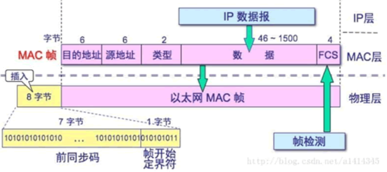

**数据链路层**（Data Link Layer）：在两个网络实体之间提供数据链路的创建、维持和释放管理。

数据链路层的协议：

* 以太网（IEEE 802.3）
* WIFI（IEEE 802.11）

接下来主要以以太网的数据传输作为主线进行分析，去除了其中的一些细节，不在此处讨论。数据传输的流程可以概括成：

成帧	----->	寻址	----->	传输

## 1. 成帧

网络层的数据包经链路层传送之前，几乎所有的链路层协议都要将其用链路层帧封装起来。一个帧由一个数据字段和若干首部和尾部字段组成。其中网络层的数据报就插在数据字段中。接下来看一下以太网数据帧：

上图每个字段的含义如下：

* 前同步码：7个字节，1和0交替。用来使接收端的适配器在接收MAC帧时能够迅速调整时钟频率，使它和发送端的频率相同。

* 帧开始定界符 ：字节，前6位1和0交替，最后两个连续1表示告诉接收端适配器：帧信息来了，准备接收。

* 目的地址：接收帧网络适配器的物理地址（MAC地址），6个字节。

* 源地址：发送帧的网络适配器的物理地址（MAC地址），6个字节。

* 类型：网络层协议的类型。由于网络层协议众多，所以在处理数据的时候必须设置该字段，标识数据交付哪个协议处理。如IP协议字段为0x0800。

* 数据：有效荷载，表示交付给网络层的数据。以太网数据帧长度最小为46字节，最大为1500字节。如果不够46字节，则会填充至最小长度。最大长度也叫最大传输单元（MTU）。linux中可以使用ifconfig查看该值。

* 帧检验序列：4个字节，检测该帧在传输过程中是否出现差错。发送方计算帧的循环冗余码校验值（CRC），把这个值写道FCS字段中。接收方重新计算接收数据的CRC，并与FCS的值及进行比较，不过不同，则需要重传。

  

## 2. 寻址

现在数据帧准备好后，需要发送给目的地址的网络适配器。此时，需要先探索出一条通路，以供源端将数据发送到目的端。接下来我们会讨论这条路的探索，不过在这之前，有以下问题需要注意一下：

参照以太网数据帧格式，目的地址和源地址是如何产生的？

1. 首先关于源地址，我们的网络适配器如网卡会自带一个MAC地址，这个MAC地址在该网络适配器被生产出来的时候就分配好了。至于网络适配器的ip是如何得到的，我们在后续讨论。

2. 按照我们日常生活中访问网站的流程，如百度，我们会在浏览器地址栏输入*www.baidu.com*，这个地址叫做域名，然后DNS服务器会将这个域名转化为百度服务器的ip地址，接着这个ip地址会根据ARP协议转化为服务器网络适配的MAC地址。

至此，我们得到了数据链路层的源地址和目的地址。接下来我们再细致地了解一下其原理：

### 2.1 MAC地址

MAC地址（Media Access Control Address），直译为媒体访问控制地址，也称局域网地址（LAN Address）、以太网地址（Ethernet Address）或物理地址（Physical Address）。MAC地址用于在网络中唯一表示一个网卡。

MAC地址共48bit，6字节，以16进制表示。第1bit为广播地址（0）/群播地址（1），第2bit为广域地址（0）/区域地址（1）。第3~24bit由IEEE决定如何分配给每一家厂商（无重复），后24bit由厂商自定义且不重复。

------

引申一下，ip地址和mac地址的关系？

每个人的理解不同。从个人角度来说，在通信时我们需要找到目的设备，为了区别每个设备，我们赋予给个设备一个id，这样我们根据设备的id号就可以找到传输的对象。这个id号我们用MAC地址来表示。理论上只需要用MAC地址就可以完成数据的传输。

但是考虑到实际生活中设备量十分巨大，网络十分庞大，只有MAC地址进行查找是非常困难的。原因是MAC地址不利于查找和管理，例如，A拥有一台笔记本pc，今天他在深圳，B通过网络向A发送消息，此时服务器费了牛鼻子劲构建了一条B到A的通络（因为设备可以有2^48个），这条通络被缓存下来。过两天A又去上海了，B又向A发消息，那原先缓存的那条通路又失效了，又要进行查找，这时服务器说我不干了，累死了！又或者A的网卡坏了，他又换了一块网卡，还得告诉B和服务，说兄弟，我的MAC地址变了，你们要更新一下，两个人还好说，一亿个人呢，太麻烦了。

为了便于查找和管理，于是ip地址出世了。ip地址以ipv4为例，共32bit，4字节。ip地址的划分后续讨论。此处你可以将ip理解为现实生活中你所在的街道，这样我们在根据ip进行查找是效率就非常方便了，同时管理上也很方便，不会出现随意变动的场景。

------

