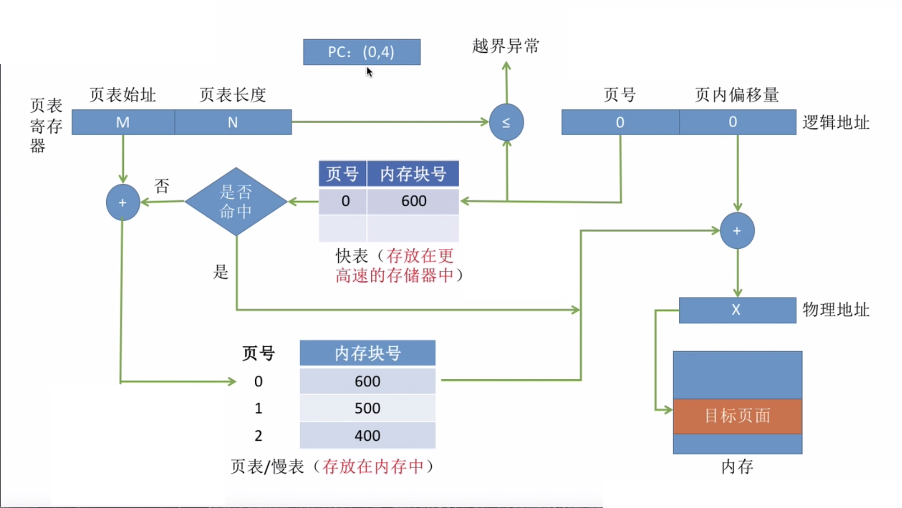

## 内存管理

操作系统对内存管理通常需要实现以下四个需求：

* 内存空间的分配和回收
* 内存保护
* 内存空间的扩充
* 地址转换

------

### 内存空间的分配和回收

**连续分配：**

* 单一连续分配
* 固定分区分配
* 动态分区分配
  * 首次适配：从头查找，找出第一个满足的内存块。
  * 最佳适配：空闲内存排序，取出最小适应的内存块。
  * 最坏适配：空闲内存排序，取出最大适应的内存块。
  * 临近适配：每次从上一次结束位置开始查找，规则和首次适配一样。

**非连续分配：**

* 基本分页存储管理

  将物理内存分页，将进程分页，各页面离散放到内存块中。每页都有一个编号，从0开始，程序加载到内存中时，会被拆分成多个页加载，然后分别加载到内存中的不同的页。

  优点：不会产生外部碎片，只会产生少量的页内碎片；缺点：不方便按逻辑模块实现信息的共享和保护。

  页表：记录页面和时机内存块之间的映射关系。

  逻辑地址：页号和页面偏移量。

* 基本分段存储管理

  分段思想和分页类似，一个程序可以被分为多个段，每个段在内存中占据连续的空间，各个段之间可以不相邻。内存地址空间根据模块进行划分，每个段都有段名，每个段从0开始编址。

  优点：很方便按逻辑模块实现信息的共享和保护；缺点：如果段长过长，分配大的连续的内存空间很不方便，段式分配会产生外部内存碎片。

  段表：存放段内存的映射表（段号，段长，基址）

  逻辑地址：段号和段内地址

  段表寄存器：段表始址和段表长度

* 段页式存储管理

  先分段后分页。

  逻辑地址：段号、页号，页面偏移量

  段表寄存器：段表始址和段表长度

------

### 内存保护

不同进程的地址空间应该互相独立，各进程应该在自己的内存空间内运行，不会越界访问。

* 设置上下限寄存器，用于检查地址是否越界
* 采用重定位寄存器（存放进程起始物理地址）和界地址寄存进行越界检查（存放进程最大逻辑地址）。

------

### 内存空间的扩充

* 覆盖技术：内存不够时，覆盖不同的内存

* 交换技术：内存不够的时候，内存交换。

  内存紧张时，根据一定的策略把某些进程的内存空间换到外存，把需要的数据从外存加载到内存。通常磁盘文件为文件去和对换区，对换区采用连续存储，文件区采用随机存储，对换区的存取效率比文件区高。进程中被换出的内存将会放到对换区。

* 虚拟存储技术

------

### 地址转换

* 快表

  为了提高地址变换速度，操作系统在高速缓存维护了一份页表的副本，对应内存中的页表称为慢表，快表只存放一部分慢表，快表其实是对页表做了缓存，加快了访问速度，引入快表后的地址变换过程如下：
  

* 多级页表

  单级页表存在的问题：页表必须连续存放，页表很大的时候，占用空间大。

  部分页面经常使用，部分页面很少使用甚至不用，没必要加载整个页表到内存中。

  把分页的思想应用于页表上，建立一张页目录表用于存放页表的页号，多级页表的逻辑地址就由一级页号，二级页号，三级页号…页内偏移量组成

---
## 虚拟内存
很多情况下，现有内存无法满足仅仅一个大进程的内存要求(比如很多游戏，都是10G+的级别)O很多情况下，现有内存无法满足仅仅一个大进程的内存要求(比如很多游戏，都是10G+的级别)。程序在装入内存中时，精要用到的内存部分装入内存，暂时没用到的部分留在外存，就可以让程序运行了，内存不够的时候，将暂时用不到的内存信息换出到外存。
虚拟内存的实现：**虚拟页式内存管理**
虚拟页式内存管理技术=页式内存管理+请求调页+页面置换功能。
