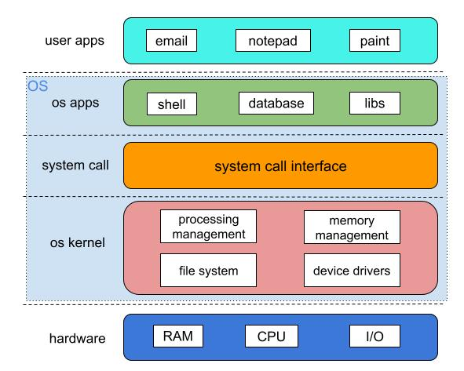

# 操作系统
操作系统（Operating System）是一组主管并控制计算机操作、运用和运行硬件、软件资源。理解：OS是用户和硬件资源的中间人。有了操作系统，用户就只管下达指令，而无需关心具体的实现。

按照现代的标准，一个标准PC的操作系统应提供以下的功能：  

* 进程管理（Processing Management）
* 内存管理（Memory Management）
* 文件系统（File System）
* 驱动管理（Device Drivers）
* 网络管理（Networking）
* 安全管理（Security）
* 用户界面（User Interface）

------

注意：要区分OS和OS内核。OS是包含了内核的完整系统软件，而内核只是系统内部的核心组成部分。
