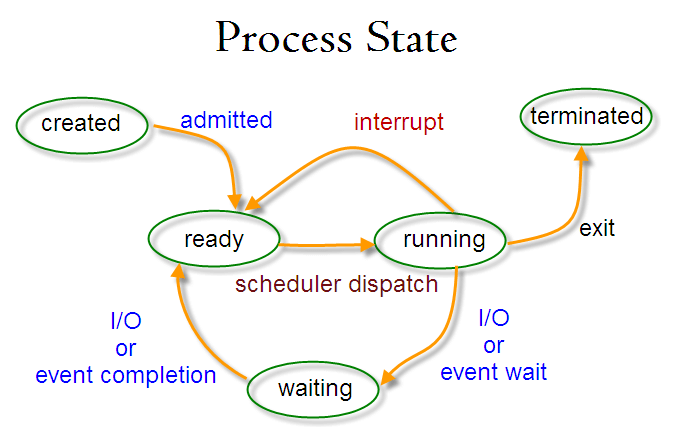

## **进程管理**

### 进程

进程（process）是指计算机已运行的程序。在分时系统中，进程是系统的基本运作单位；在面向进程设计的系统（如早期的unix，linux2.4及更早的版本）中，进程是程序的基本执行实体；在面向贤臣设计的系统（当代多数操作系统，linux2.6及更新的版本）中，进程本身不是基本运行单位，而是线程的容器。

从不同的角度看，进程可以有不同的定义：

1）进程是程序的一次执行过程。

2）进程是一个程序及其数据在处理机上顺序执行时所发生的活动。

3）进程是具体独立功能的程序在一个数据集合上运行的过程，是系统进行资源分配和调度的一个独立单位。

*引入进程是为了更好地使多道程序并发执行，提高资源利用率和系统吞吐量*。

**进程的组成**

* 程序的代码
* 程序处理的数据
* 程序计数器中的值
* 一组通用的寄存器的当前值、堆、栈
* 一组系统资源（如打开的文件）

**进程、线程、程序**

* 程序

  程序是含有指令和数据的文件，被存储在磁盘中，是静态的代码。

* 线程

  独立调度的基本单位。

  *引入线程是为了减小程序在并发执行时所付出的时空开销，提高系统的并发性能。*

* 进程和线程的联系

  1）拥有资源：

  要准确理解这里说的系统资源。它指处理机、存储器和其他设备服务于某个进程的”时间”，例如把处理机资源理解为处理机的时间片才是准确的。因为进程是这些资源分配和调度的独立单位（还没引入线程），即“时间片”分配的独立单位，这就决定了进程一定是一个动态的、过程性的概念。

  进程是资源分配的基本单位，但是线程不拥有资源，线程可以访问隶属进程的资源。

  2）调度

  线程是独立调度的基本单位，在同一进程中，线程的切换不会引起进程切换，从一个进程中的线程切换到另一个进程中的线程时，会引起进程切换。

  3）系统开销

  由于创建或撤销进程时，系统都要为之分配或回收资源，如内存空间、I/O 设备等，所付出的开销远大于创建或撤销线程时的开销。类似地，在进行进程切换时，涉及当前执行进程 CPU 环境的保存及新调度进程 CPU 环境的设置，而线程切换时只需保存和设置少量寄存器内容，开销很小。

* 多线程、异步、并行的区别

  先说异步，异步强调的是非阻塞，是一种编程模式。

  多线程是一种技术，强调是并发。

  并行基于多线程技术，但它强调的是高效完成计算任务，而不是并发数量。

### 进程控制块PCB

PCB是操作系统管理进程运行所用的信息集合。

每个进程都维护了一个PCB，用来保存该进程有关的各种状态信息：

* 进程描述信息

  进程标识符（process id）、进程名、用户标识符（user id）、进程组关系

* 进程控制信息

  当前状态、优先级、代码执行入口地址、程序的磁盘地址、运行统计信息（执行时间、页面调度）、进程间同步和通信、进程的队列指针、进程的消息队列指针。

* 所拥有资源和使用情况

  虚拟地址空间的使用情况、打开的文件列表

* cpu线程信息

  当cpu不运行的时候记录一些重要的信息：寄存器值（用用寄存器、程序计数器pc、程序状态字psw，栈指针）；执行该进程页表的指针。

### 进程状态

* 就绪状态（ready）：等待被调度
* 运行状态（running）
* 阻塞状态（waiting）：等待资源

注意：

1）只有就绪态和运行态可以相互转换，其它的都是单向转换。就绪状态的进程通过调度算法从而获得 CPU 时间，转为运行状态；而运行状态的进程，在分配给它的 CPU 时间片用完之后就会转为就绪状态，等待下一次调度。

2）阻塞状态是缺少需要的资源从而由运行状态转换而来，但是该资源不包括 CPU 时间，缺少 CPU 时间会从运行态转换为就绪态。

### 调度算法

不同的环境调度算法目标不同：

* 批处理系统

  批处理系统没有太多的用户操作，在该系统中，调度算法的目标是保证吞吐量和周转时间。

  1）FCFS（first-com first-serverd）非抢占式调度算法，按照请求顺序进行调度。

  2）SJF（shortest job first）非抢占式调度算法，按照估计运行时间进行排序（最短先运行）。

  3）SRTN（shortest remaining time next）抢占式调度算法，按照剩余运行时间的顺序进行调度。

* 交互式系统

  交互式系统有大量的用户交互操作，在该系统中，调度算法的目标是快速响应用户的操作。

  1）时间片轮转

  将所有就绪进程按照FCFS的原则排成一个队列，每次调度，把cpu时间分配给队首进程，该进程可以执行一个时间片。当时间片用完时，由计时器发出时钟中断，调度程序便停止该进程的执行，并将它送往就绪队列的末尾，同时继续把cpu时间分配给队首进程。

  时间片轮转算法的效率和时间片的大小有很大关系：

  因为进程切换需要保存进程的信息并载入新进程的信息，如果时间片太小，会导致进程切换的太频繁，在进程切换上花费较多时间，导致进程运行的效率降低；如果时间片过长，那个实时性就得不到保证。

  2）优先级调度

  为每个进程分配一个优先级，按优先级进行调度。为了防止低优先级的进程永远等不到调度，可以随着时间的推移增加等待进程的优先级。

  3）多级反馈队列

  一个进程需要执行100个时间片，如果采用时间片轮转调度算法，那么需要交换100次。

  多级队列是为了这种需要连续执行多个时间片的进程考虑，设置了多个队列，每个队列时间片大小都不同，例如1，2，4，8，...。进程在前一个队列没执行完，就会被移到下一个队列。这种方式下，之前的进程只需要交换7次。（1+2+4+8+16+32+64）。

  每个队列优先权也不同，最上面的优先权最高。因为只有上一个队列没有进程在排队，才能调度当前队列上的进程。

  可以见这种调度算法看成时间片轮转调度算法和优先级调度算法的结合。

* 实时系统

  实时系统要求一个请求在一个确定时间内得到响应。

  分为硬实时和软实时，前者必须满足绝对的截止时间，后者可以容忍一定的超时。

### 进程同步

* 临界区

  对临界资源进行访问的那段代码称之为临界区。

* 同步与互斥

  同步：多个进程因为合作产生的直接制约关系，使得进程有一定的先后执行关系；

  互斥：多个进程在同一时刻只有一个进程能进入临界区

* 信号量

  信号量（semaphore）是一个整型变量，可以对其进行down和up操作，也就是常见的P、V操作。

  down：如果信号量大于0，执行-1操作；如果信号量等于0，进程睡眠，等待信号量大于0；

  up：对信号量执行+1操作，唤醒睡眠的进程让其完成down操作。

* 管程

  使用信号量机制实现的生产者消费者问题需要客户端代码做很多控制，而管程把控制的代码独立出来，不仅不容易出错，也使得客户端代码调用更容易。c 语言不支持管程。

  管程有一个重要特性：在一个时刻只能有一个进程使用管程。进程在无法继续执行的时候不能一直占用管程，否则其它进程永远不能使用管程。

  管程引入了 **条件变量** 以及相关的操作：**wait()** 和 **signal()** 来实现同步操作。对条件变量执行 wait() 操作会导致调用进程阻塞，把管程让出来给另一个进程持有。signal() 操作用于唤醒被阻塞的进程。

